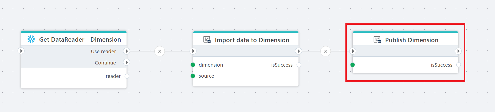

# Publish Dimension

Publishes a Dimension in an InVision Solution.

**Example**   
This flow loads data into a Dimension and then publishes it. It begins with loading data from a table in Snowflake - [Get DataReader](../snowflake/get-datareader.md). That reader is passed to [Import data to Dimension](import-data-to-dimension.md), where the records are written into the specified Dimension. After a successful import, the flow calls **Publish Dimension** to apply the changes so the updated Dimension becomes available in the solution.

 

## Properties 

| Name                 | Type     | Description                                      |
|----------------------|----------|--------------------------------------------------|
| Title                |          |   A descriptive title for the action.      |
| Connection           | Required | [InVision Connection](invision-connection.md).                             |
| Dimension            | Required | Select or enter the ID of the Dimension you want to publish.         |
| Result variable name | Optional | Name of the result variable containing the result (e.g., `isSuccess`). |
| Description          | Optional | Additional notes or comments about the action or configuration. |

 

## Returns

Boolean value (true or false).