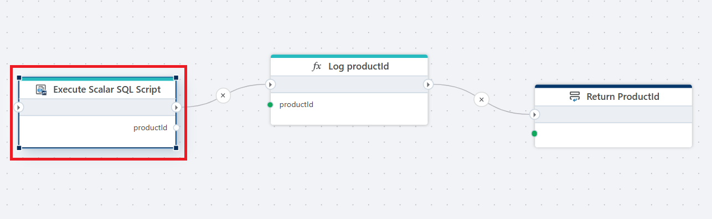

# Execute long running SQL Script

Execute a long running [SQL Script](/articles/invision/docs/sqlscripts.md) defined in an InVision Solution.

 

**Example**   
This flow executes a SQL query defined in an InVision Solution to retrieve a single value (productId), logs that value for debugging or auditing purposes, and then returns it as the output of the flow.

>[!NOTE]
> If your SQL Script may take longer than 5 minutes to execute, use the Long Running SQL Script action instead of the regular SQL Script action.