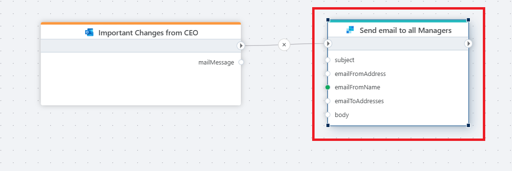

# Send Email

Use this action to send emails through your configured **SendGrid** connection in Profitbase Flow.

 

## Example Flow

**This flow retrieves files or content from a source system and sends an automated email using SendGrid.**  
For example, you could trigger a flow when a form is submitted, build a PDF, and email it to the recipient with custom messaging and attachments.

 

## Getting Started with SendGrid

To use this action, you need a configured [SendGrid connection](./sendgrid-connection.md) with a valid API key and at least one approved sender.

Refer to the official documentation for additional setup and best practices:
- [SendGrid documentation](https://docs.sendgrid.com/)
- [Sending email via Microsoft Azure](https://docs.sendgrid.com/for-developers/partners/microsoft-azure-2021)

 

## Action Properties

| Property            | Type     | Description |
|---------------------|----------|-------------|
| Title           | Optional  | A custom label for the action in the Flow UI. |
| Connection      | Required | Choose or create a SendGrid connection with a valid API key. |
| From email      | Required | The sender's email address. Must match one of the verified senders in the connection. |
| From name       | Required | The display name for the sender (e.g., "Finance Department"). |
| To              | Required | One or more recipient email addresses, separated by semicolons. |
| Subject         | Required | The subject line of the email. |
| Message         | Required | The main message body. Can include dynamic content or expressions. |
| Attachments     | Optional | Upload or select files to include as attachments. |
| Description     | Optional | Internal documentation or notes for Flow designers. Not included in the email. |

 

## Notes

- The email will be sent on behalf of the selected sender.
- Make sure your API key has sufficient permissions (Mail Send) in SendGrid.
- The message supports plain text and basic HTML formatting.

 

## Related Documentation

- [Create SendGrid connection](./sendgrid-connection.md)
- [SendGrid Email API](https://docs.sendgrid.com/api-reference/mail-send/mail-send)
- [Sender Identity Setup](https://docs.sendgrid.com/ui/sending-email/sender-verification)