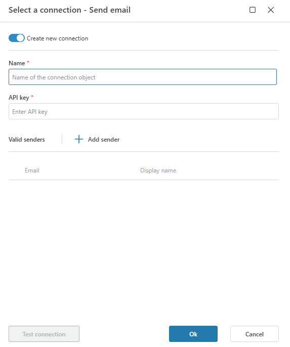
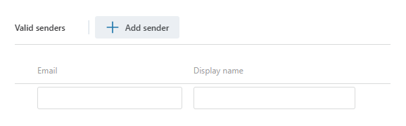

# SendGrid Connection

To send emails using **SendGrid** in Profitbase Flow, you must create a connection using a valid **API key** and define one or more **approved sender addresses**.

This connection enables you to securely send transactional or notification emails directly from a flow.

 

## Connection Fields

| Field       | Description |
|-------------|-------------|
| **Name**    | Required. A name for the connection object that will be shown in the Flow designer. |
| **API Key** | Required. Your SendGrid API key used to authenticate requests. This must have permission to send emails. |

 

## Valid Senders

In addition to the API key, you must configure at least one **valid sender** by specifying:

- **Email** – The address that will appear in the "From" field of sent emails.
- **Display Name** – (Optional) A user-friendly sender name that will appear along with the email address.

You can add multiple senders to a single connection. These must be verified in your SendGrid account if domain authentication is enabled.

 

## How to Create the Connection

1. Open the **Send Email (SendGrid)** action in your Flow.
2. Toggle on **Create new connection**.
3. Enter the **connection name**.
4. Paste a valid **SendGrid API key**.
5. Click **Add sender** and enter a sender **email address** and optional **display name**.
6. (Optional) Add multiple senders as needed.
7. Click **Test connection** to verify the key and sender settings.
8. Click **OK** to save the connection.

 

## Screenshots

### Connection Configuration

### Adding Senders

 

## Notes

- The **API key** must be created in your SendGrid account under **Settings → API Keys** with `Mail Send` permission enabled.
- If you're using sender identity verification, ensure that all email addresses used are either **domain authenticated** or **individually verified** in SendGrid.
- You can rotate API keys without updating the Flow connection as long as the new key has the same scope and permissions.

 

## Related Documentation

- [Send Email with SendGrid in Flow](send-email.md)