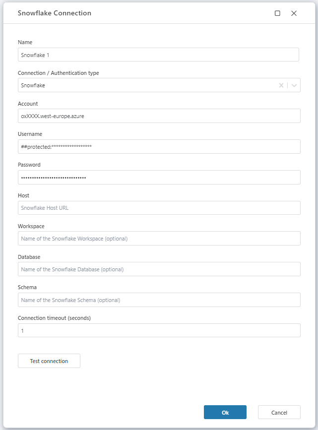

# Connecting to Snowflake

To use Snowflake actions in **Profitbase Flow**, you must either select an existing connection or create a new one.

 

## Connection Type
Before entering server details, select the appropriate connection type (authentication method). Available options:
   
 - Username and Password authentication (aka Snowflake, to be deprecated) 
 - Programmatic Access Token authentication 
 - Key Pair authentication 
 - custom connection string  

## Generic connection properties

A Snowflake connection consists of the following generic fields:

| Property                   | Description                 |
| -------------------------- | --------------------------- |
| Connection Name            | The name of the connection. |
| Account             | Either the Account name or the full Account name, including any segments that identify the region and cloud platform where the account is hosted. If the full Accont name is used, the Host property can then be ignored. |
| Host               (optional)  | The hostname for your account in the format: `<ACCOUNT>.snowflakecomputing.com`. |
| Workspace          (optional)  | The workspace name. |
| Database            (optional) | The database name. |
| Schema             (optional)  | The schema name. |
| Connection Timeout  (optional) | Timeout duration for the connection in seconds. |

 

## Username and Password authentication properties

| Property            | Description   |
| --------------------| -------------------------------- |
| User                | The username for the connection. |
| Password            | The password for the user. |

### Note: this is to be deprecated. 

 

## Programmatic Access Token authentication properties

| Property      | Description                 |
| ------------- | -------------------------------------------------------------- |
| User          | The username for the connection. |
| Access Token  | The Access Token created for the user in the Snowflake portal. |

[Ref: configuring programmatic access tokens for authentication](https://docs.snowflake.com/en/user-guide/programmatic-access-tokens)
 

## Key-Pair authentication properties

| Property            | Description                 |
| --------------------| ----------------------------------------------------------------------------------------- |
| User                | The username for the connection. |
| Key password phrase | The password /password phrase used when creating the encrypted key and/or the public key. |
| Private Key         | The Private Key belonging to the Public Key added for the user in the Snowflake portal. |

Note: The (pasted) Private Key should start with ----BEGIN [ENCRYPTED] PRIVATE KEY---- and end with ----END [ENCRYPTED] PRIVATE KEY----.

[Ref: configuring key-pair for authentication](https://docs.snowflake.com/en/user-guide/key-pair-auth)
 

## Custom connection string

| Property          | Description   |
| ------------------| ------------------------------------------------------------------------------------------------ |
| Connection String | Required | A full custom connection string that defines all necessary parameters for connecting. |
| User              | The username for the connection. |
| Password          | The password for the user. |

A **custom connection string** can be used instead of filling individual fields.  
This string overrides all standard connection settings except for the **username** and **password**, which are strongly recommended to be stored in protected fields rather than embedded directly into the connection string.

 

## Sample connection

 

## Notes

- Ensure the account name and region match the Snowflake deployment.
- If using a custom string, validate the connection before saving.
- Sensitive values like passwords should not be placed directly in the connection string for security reasons. One way to do this, is to use protected Workspace Variables.

 

## Related resources

- [Snowflake User Guide – Connecting](https://docs.snowflake.com/en/user-guide/connecting)
- [Snowflake .NET Connector – Connection string format](https://github.com/snowflakedb/snowflake-connector-net/blob/master/doc/Connecting.md)
