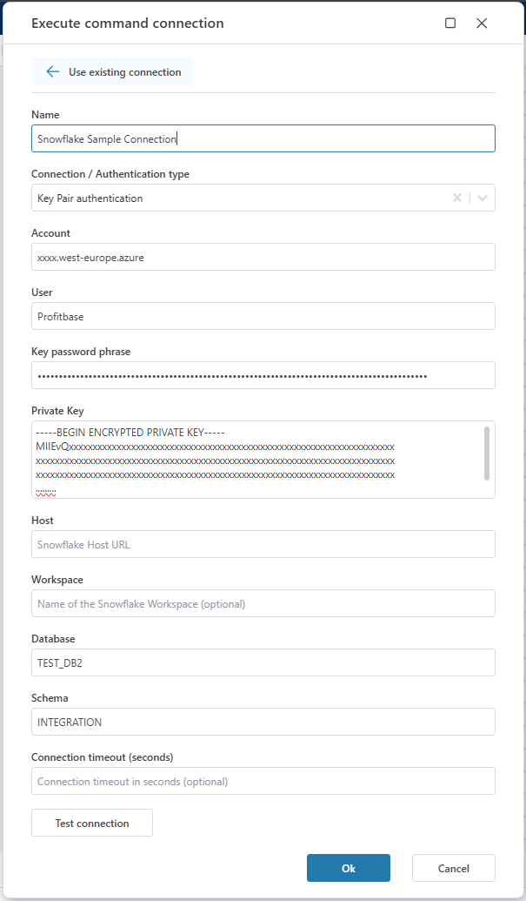

# Connecting to Snowflake

[Ref. Logging in to Snowflake documentation.](https://docs.snowflake.com/en/user-guide/connecting )

When adding a Snowflake action, select an existing connection or create a new one. 
To [edit existing connections](../../workspaces/workspace-objects.md), select the 'Workspace' menu and then 'Workspace Objects'.

## Connection details

A Snowflake connection consists of the following fields:

| Field | Description |
| --------------------- | -------------------------------------------------------------------- |
| Connection Name | Name of the connection. Required. |
| Connection Type | Whether to use a custom connection string (see below), or Snowflake default connection type. |
| Account | Your full account name might include additional segments that identify the region and cloud platform where your account is hosted. |
| Username | Required. |
| Password | Required. |
| Host | Optional. Specifies the hostname for your account in the following format: <ACCOUNT>.snowflakecomputing.com. |
| Workspace | Optional workspace name. |
| Database |  Optional database name. |
| Schema | Optional schema name. |
| Connection Timeout | Optional connection timeout in seconds. | 

[For a detailed documentation, click here](https://github.com/snowflakedb/snowflake-connector-net/blob/master/doc/Connecting.md).

## Sample connection 

## Custom connection string

A custom connection string replaces all fields except for optionally username and password. It is recommended that these are placed in the protected fields and not in the connection string.
