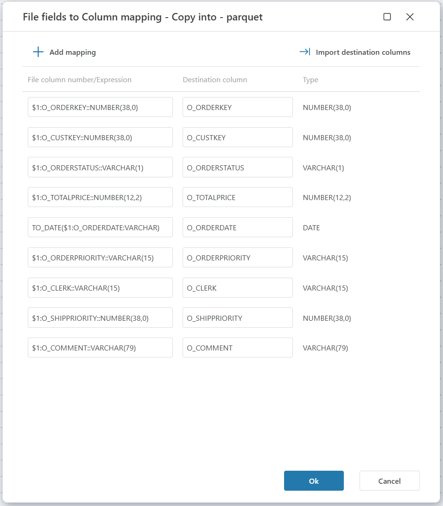

# Copy Into

Copies data from a staged file to a Snowflake database.

## Returns 

Optional: [Int32](https://learn.microsoft.com/en-us/dotnet/api/system.int32) The number of rows affected/inserted.

## Properties

| Name                      | Data type | Description                                                                                         |
|---------------------------|-----------|-----------------------------------------------------------------------------------------------------|
| Title                     | Optional  | The title or name of the command.                                                                   |
| Connection                | Required  | The Snowflake [connection](./connecting-to-snowflake.md).                                          |
| Stage name                | Required  | Select an existing Share name (will be prefixed by @).                                             |
| File name                 | Required  | Select the name of the file to import from.                                                        |
| File format settings      | Required  | Select the file type and optional settings for parsing.                                                |
| Destination table         | Required  | Select or enter the name of the table to copy into.                                                |
| Transformation/mappings   | Optional  | Map between file fields and destination table columns.      |
| Result variable name      | Optional  | Name of the result variable containing the number of inserted rows.                                 |
| Description               | Optional  | Additional notes or comments about the action or configuration.                                     |

## File format settings 

Options for CSV files

Options for JSON files

> [!NOTE]
>
>- The Stage must exist and can be set up, for example, as Microsoft Azure Blob storage or an Amazon S3 Bucket.
>- System supports the Parquet format for data storage and processing. However, it is essential to configure the appropriate transformation settings to ensure optimal performance and compatibility.

