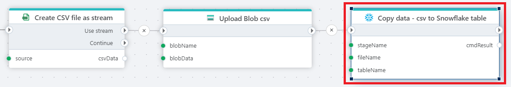

# Copy Into

Copies data from a staged file to a Snowflake database.

## Returns 

Optional: [Int32](https://learn.microsoft.com/en-us/dotnet/api/system.int32) The number of rows affected/inserted.

## Properties

| Name         | Data type       | Description                                       |
|--------------|-----------------|---------------------------------------------------|
| Title | Optional | The title or name of the command.  |
| Connection | Required |  The Snowflake [connection](./connecting-to-snowflake.md). |
| Stage name | Required | Select an existing Share name (will be prefixed by @). |
| File name | Required | Select the name of the file to import from. |
| File format settings | Required | Select file type and optional settings for parsing. |
| Destination table | Required | Select or enter the name of the table to copy into. |
| Result variable name | Optional | Name of the result variable containing the number of inserted rows. |
| Description | Optional | Additional notes or comments about the action or configuration. |

<!-- ## File format settings 

### Options for CSV files

### Options for JSON files

### Options for Parquet files -->

> [!NOTE]
>
>- The Stage must exist and can be set up, for example, as Microsoft Azure Blob storage or an Amazon S3 Bucket.
>- Parquet is not available yet due to date parsing issues.

