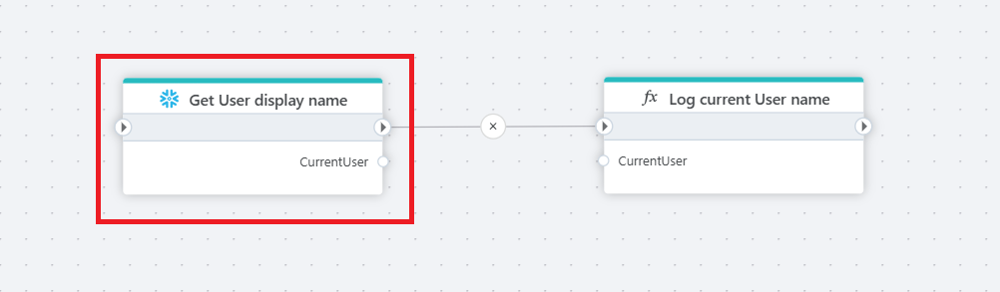

# Get single value

Executes a query command in a [Snowflake](https://docs.snowflake.com/en/user-guide-getting-started) database which returns a single value.



<br/>

## Properties

| Name         | Type       | Description                                       |
|--------------|-----------------|---------------------------------------------------|
| Title           |   Optional | The title or name of the command.    |
| Connection         | Required   | The Snowflake [connection](./connecting-to-snowflake.md). |
| Expression and parameters   | Required      | The command to execute along with any parameters.   |
| Result variable name | Optional  | Name of the variable.  |
| Result variable type | Optional  | Type of the variable.  |
|Command timeout (seconds) | Optional | The time limit for command execution before it times out. Default is 120 seconds.|
| Description   | Optional | Additional notes or comments about the action or configuration. |

<br/>

## Returns

Returns a .NET value of the type specified by `Result variable type`.

<br/>

## Example: How to use parameters

To use parameters in the query, declare and assign variables in the `Parameters` property.  
Then use the parameters in the query.

```sql

SELECT Display_Name FROM Snowflake.Account_Usage.Users WHERE USER_ID = :UserId

```

<br/>

## Example: How to use variables in the command expression

To use Flow variables in a SQL query as part of the expression, you need to first [declare a variable](../built-in/declare-variable.md) as `Global` and [assign a value to the variable](../built-in/set-variable.md).  
Then, enclose the variable in curly brackets like with the `TableName` variable shown in the example below.

```sql
-- We have declared a Flow variable named TableName and assigned a value to it in a previous action.
SELECT Display_Name FROM {TableName} WHERE USER_ID = :UserId
```
