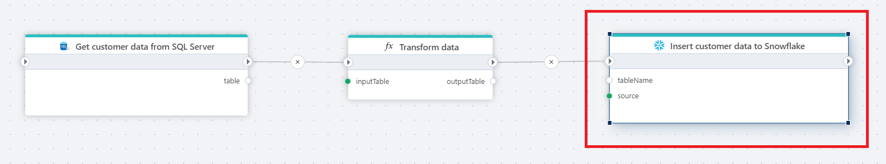

# Insert rows

Inserts rows into a [Snowflake](https://docs.snowflake.com/en/user-guide-getting-started) database from a [DataReader](https://learn.microsoft.com/en-us/dotnet/api/system.data.idatareader) or a [DataTable](https://learn.microsoft.com/en-us/dotnet/api/system.data.datatable).

**Example**   
This flow retrieves customer data from SQL Server, applies a transformation step, and then inserts the transformed data into a Snowflake table. It returns the number of rows successfully inserted.

## Returns 

[Int32](https://learn.microsoft.com/en-us/dotnet/api/system.int32) The number of rows affected/inserted.

## Properties

| Name         | Data type       | Description                                       |
|--------------|-----------------|---------------------------------------------------|
| Title | Optional | The name of the action. |
| Connection | Required |  The Snowflake [connection](./connecting-to-snowflake.md). |
| Source | Required | Select the source for data (DataReader or DataTable). |
| Destination table | Required | Select or enter the name of the table to insertinto. |
| Result variable name | Optional | Name of the result variable containing the number of inserted rows. |
| Description | Optional | Additional notes or comments about the action or configuration. |
