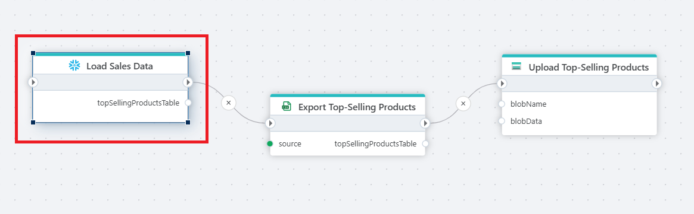

# Load to Datatable

Loads data from a [Snowflake](https://docs.snowflake.com/en/user-guide-getting-started) database into memory as a [DataTable](https://learn.microsoft.com/en-us/dotnet/api/system.data.datatable) object.

 

## Properties

| Name         | Type       | Description                                       |
|--------------|-----------------|---------------------------------------------------|
| Title       | Optional | The title or name of the command. |
| Connection  | Required | The Snowflake [connection](./connecting-to-snowflake.md). |
| Expression and parameters | Required | The query expression to execute along with any optional parameters.   |
| Table variable name | Required | Name of the variable that will contain the data table.  |
| Command timeout (sec) | Optional | The time limit for command execution before it times out. Default is 120 seconds.|
| Description | Optional | Additional notes or comments about the action or configuration. |

 

## Returns

[DataTable](https://learn.microsoft.com/en-us/dotnet/api/system.data.datatable)
