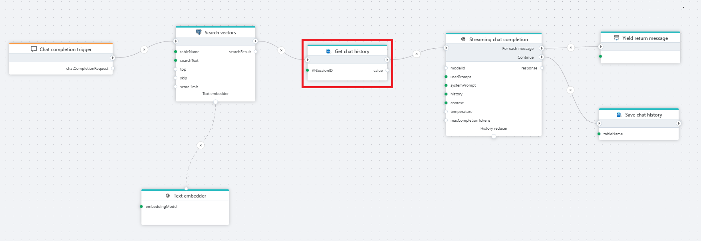

# Get single value

Executes a SQL command in a SQL Server database which returns a single value.




**Example**   
The example above shows a Flow that provides chat completions to a chat client. We're using [PostgreSQL vector search](../postgresql/vector-search.md) to enable RAG, and SQL Server (Get single value) to store and retrieve the chat history so that users can ask follow-up questions.

<br/>

## Properties

| Name         | Type            | Description                                       |
|--------------|-----------------|---------------------------------------------------|
| Title              | Optional        | A descriptive title for the action.               |
| Connection      | Required | The [SQL Server Connection](./connection.md).         |
| Dynamic connection | Optional | Use this option of you needs to use a connection from the [Create Connection](./create-connection.md) action. |
| SQL expression and parameters   | Required      | The command to execute along with any parameters.   |
| Result variable name | Required  | Name of the variable.  |
| Result variable type | Required  | Type of the variable.  |
| Command timeout (sec) | Optional | The time limit for command execution before it times out. Default is 120 seconds.|
| Description   | Optional | Additional notes or comments about the action or configuration. |

## Example: How to use parameters

To use parameters in the query, declare and assign variables in the `SQL parameters` property.  
Then use the parameters in the query.

```sql

SELECT [Name] FROM Users WHERE UserId = @UserId

```

## Example: How to use variables in the command expression

To use Flow variables in a SQL query as part of the expression, you need to first [declare a variable](../built-in/declare-variable.md) as `Global` and [assign a value to the variable](../built-in/set-variable.md).  
Then, enclose the variable in curly brackets like with the `TableName` variable shown in the example below.

```sql
-- We have declared a Flow variable named TableName and assigned a value to it in a previous action.
SELECT [Name] FROM {TableName} WHERE UserId = @UserId
```

## Returns

Returns a .NET value of the type specified by `Result variable type`.

<br/>

[!INCLUDE [](__videos.md)]
