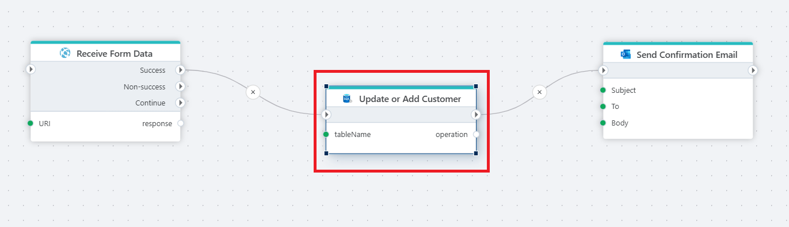

# Insert or update row
Performs an insert or update on a table based on column-value mappings and returns the name of the action performed. 

**Example**

The Flow above illustrates how to use the `Insert or Update row` action to save customer information to a SQL Server database fetched from a web API. Actions used in this Flow are: [HTTP Request](../http/http-request.md), `Insert or update row`, and [Send email](../microsoft-365-outlook/send-email.md).

## Properties

| Name               | Type            | Description                                       |
|--------------------|-----------------|---------------------------------------------------|
| Title              | Optional        | A descriptive title for the action.               |
| Connection         | Required        | The SQL Server connection.                        |
| Dynamic connection | Optional | Use this option of you needs to use a connection from the [Create Connection](./create-connection.md) action. |
| Table name         | Required        | The name of the table to insert or update a row.      |
| Column value mapping | Required      | Defines the row to update by specifying the columns and corresponding values.|
| Result variable name |Optional        | Name of the variable containing the action performed. This always returns either `INSERTED` or `UPDATED`.  |
| Command timeout (sec) | Optional | The time limit for command execution before it times out. Default is 120 seconds.|
| Description   | Optional | Additional notes or comments about the action.|

