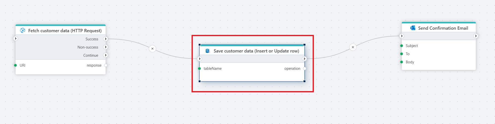

# Insert or update row
Performs an insert or update on a table based on column-value mappings and returns the executed action. This operation is built on top of the SQL MERGE statement.

**Example**

This Flow demonstrates how to automatically update or insert customer data in an SQL Server database upon receiving a registration form submission, ensuring data consistency and sending a confirmation email. Actions used in this flow are: [HTTP Request](../http/http-request.md), Insert or update row and [Send email](../microsoft-365-outlook/send-email.md).

## Properties

| Name               | Type            | Description                                       |
|--------------------|-----------------|---------------------------------------------------|
| Title              | Optional        | A descriptive title for the action.               |
| Connection         | Required        | The SQL Server connection.                        |
| Dynamic connection | Optional | Use this option of you needs to use a connection from the [Create Connection](./create-connection.md) action. |
| Table name         | Required        | Select or enter the name of the target table      |
| Column value mapping | Required      | Value to column mapping and defenition of key kolumns in the target table.|
| Result variable name |Optional        | Name of the variable containing action performed (insert or update).  |
| Command timeout (sec) | Optional | The time limit for command execution before it times out. Default is 120 seconds.|
| Description   | Optional | Additional notes or comments about the action or configuration.|

