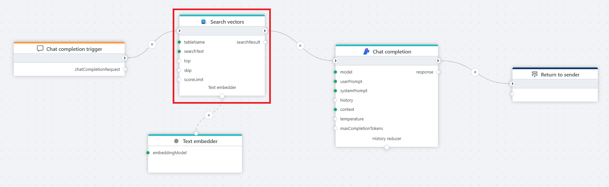
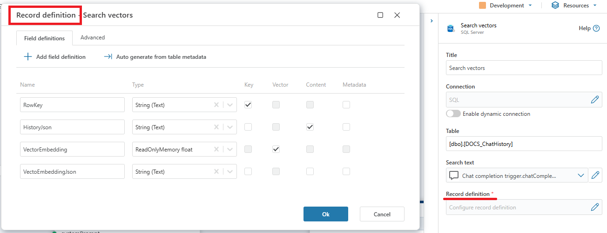

# Search vectors
Executes similarity searches on vector data in a SQL Server database.

**Example**   
This flow processes a user's chat question by first receiving it through a [Chat completion](../../triggers/ai/chat-completion-trigger.md) trigger, then converting it into a vector using a [text embedder](../azure-ai/text-embedder.md), performing a **Vector search** in an SQL database for relevant context, and finally passing the user input and retrieved context to an Azure AI [Chat completion](../azure-ai/chat-completion.md) action, which generates a response that is returned to the client via the [Return](../built-in/return.md) node.

 

## Properties

| Name                         | Type      | Description                                                                                      | 
|------------------------------|-----------|--------------------------------------------------------------------------------------------------|
| Title                        | Optional  | The title or name of the action. |
| Connection                   | Required  | The SQL Server database connection that will be used for the vector search. |
| Table                        | Required  | The name of the table where the vector search will be performed. |
| Search text                  | Required  | The input text string used to perform the vector search; can be provided dynamically. |
| Record definition            | Required  | The definition of columns used in the vector search. Note: The vector column is not returned. |
| Filter                       | Optional  | A filter expression to narrow down the records (e.g., category = blue). |
| Top                          | Optional  | The maximum number of top results to return. |
| Skip                         | Optional  | The number of top results to skip (default: *0*). |
| [Distance function](https://learn.microsoft.com/en-us/azure/cosmos-db/gen-ai/distance-functions) | Optional  |  The method for calculating vector similarity, e.g., *Cosine Distance* (default). |
| Score limit (0–2)            | Optional  | A threshold value that filters results based on similarity score (lower = more similar). |
| Prompt template              | Optional  | Controls the output format for search results. The system will replace placeholders like @[fieldName] with the relevant data. |
| Search result variable name  | Optional  | The name of the variable to store results, e.g. searchResult. |
| Command timeout (seconds)    | Optional  | The timeout duration for the SQL command (in seconds). |
| Description                  | Optional  | Additional notes or metadata for the action. |

## Record definition

You are required to specify the *key*, *content* and *vector* columns as **Field definitions**.  

## Returns 

The Search vectors action returns an object that the Chat completion Context property uses.