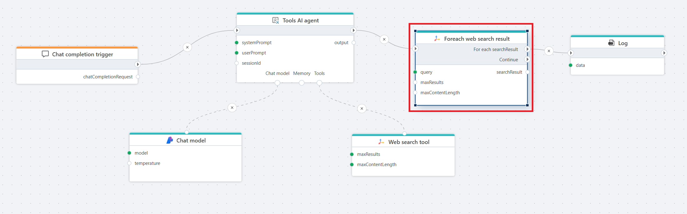

# Foreach web search result 

Iterates over each search result returned by a **Tavily web search**.  
This action creates a loop that exposes a `searchResult` variable containing properties of each item in the results array.

Use this action when you need to process each result individually—for example, logging items, enriching data, or performing conditional logic.

**Example**   
This Flow implements an AI-driven chat endpoint that can use real-time web search to generate more accurate and up-to-date responses.  
It uses the [Chat completion trigger](../../triggers/ai/chat-completion-trigger.md) to receive user input, processes the request through a [Tools AI agent](../agents/tools-ai-agent.md), and leverages the [Web search tool](web-search-tool.md) when the agent determines that external information is required.  
The returned search results are then iterated using the **Foreach web search result** action, allowing each result to be inspected or processed individually before the final output is produced.

The final response returned by the agent is logged for debugging or auditing purposes.

The Flow is useful when building chat-based experiences that require both conversational reasoning and the ability to retrieve and process current information from the internet, such as answering questions about recent news, events, or other public data.

 

## Properties

| Name                | Type       | Description |
|---------------------|------------|-------------|
| Title           | Optional   | The title of the action. |
| Connection      | Required   | Tavily [connection](connection.md) used for executing the query. |
| Query           | Required   | The text-based search query used to retrieve results. |
| Max results     | Optional   | Limits how many results to retrieve and iterate through. |
| Max content length | Optional | Maximum amount of page content to fetch per result. |
| Extract full content | Optional | When checked, the tool attempts to retrieve full page content. |
| Request timeout (seconds) | Optional | Timeout for the search request. Default is 30 seconds. |
| Result loop variable name | Optional | Name of the loop variable (default: `searchResult`). |
| Description     | Optional   | A description displayed in the designer. |

 

## Exposed variables

During each loop iteration, the following variable is available:

| Variable name | Type | Description |
|---------------|------|-------------|
| `searchResult` | `TavilyWebSearchResult` | Contains metadata such as title, URL, snippet, and scraped content (if enabled). |

 

## Notes

- This action should be used **after** a web search tool or within a Flow where the same query is used repeatedly.  
- Use this loop to apply filtering, enrichment, transformation, or evaluation logic on each search result.  
- When combined with AI actions, you can create advanced reasoning chains where the LLM evaluates each result individually.

