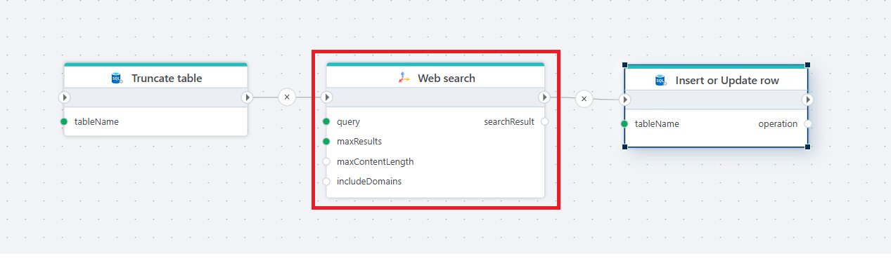

# Web search 

Returns a **Tavily Web search** result.  
This action performs a Tavily search and exposes a `searchResult` variable containing an optional Answer property and an Items array.

Use this action when you need to process the result of a web search.

**Example**   
This Flow uses a [Truncate table](../../actions/sql-server/truncate-table.md) action to clear old data, perform a web search using the **Web search** action, and then uses the [Insert or update row](../../actions/sql-server/insert-or-update-row.md) action to store the search result in a database table.

 

## Properties

| Name                | Type       | Description |
|---------------------|------------|-------------|
| Title           | Optional   | The title of the action. |
| Connection      | Required   | Tavily [connection](connection.md) used for executing the query. |
| Query           | Required   | The text-based search query used to retrieve results. |
| Max results     | Optional   | Limits how many results to retrieve and iterate through. |
| Max content length | Optional | Maximum amount of page content to fetch per result. |
| Include answer | Optional | When checked, the action attempts to retrieve a direct answer from the search. |
| Extract full content | Optional | When checked, the tool attempts to retrieve full page content. |
| Include domains | Optional | Semicolon-separated list of domains to include in the search. |
| Request timeout (seconds) | Optional | Timeout for the search request. Default is 30 seconds. |
| Search result variable name | Optional | Name of the return variable (default: `searchResult`). |
| Description     | Optional   | A description displayed in the designer. |

 

## Returns

Returns a WebSearchResult object with four properties.

| Name                     | Description                                                                 |
|--------------------------|-----------------------------------------------------------------------------|
| Answer                 | The summarized answer retrieved from the search, if available.                                                    |
| Items          | Contains a list of search result items. These items has properties called Title, URL, Score, Snippet and FullContent (extracted raw content (if enabled)) |
| IsSuccess          | Indicates whether the search was successful. |
| ErrorMessage          | Contains error message if the search failed. |