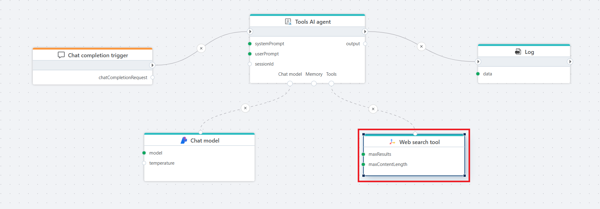

# Web search tool

Defines a Tavily **web search tool** that can be used by an AI Agent (Tools AI agent) or directly by an LLM as a callable tool.  
This tool performs a web search and returns structured search results that is passed to the Agent or LLM.

**Example**   
This Flow implements an AI-driven chat endpoint that can use real-time web search to generate more accurate and up-to-date responses.
It uses the [Chat completion trigger](../../triggers/ai/chat-completion-trigger.md) to receive user input, processes the request through a [Tools AI agent](../agents/tools-ai-agent.md), and leverages the Web search tool when the agent determines that external information is required.
The final response returned by the agent is logged for debugging or auditing purposes.

The Flow is useful when building chat-based experiences that require both conversational reasoning and the ability to retrieve current information from the internet, such as answering questions about recent news, events, or public data.

 

## Properties

| Name                | Type       | Description |
|---------------------|------------|-------------|
| Title           | Optional   | The title of the action. |
| Connection      | Required   | The Tavily [connection](connection.md) used to authenticate and perform the search. |
| Max results     | Optional   | Limits the maximum number of search results returned. |
| Max content length | Optional | The maximum total content size that can be retrieved for each result. |
| Include answer | Optional | When checked, the action attempts to retrieve a direct answer from the search. |
| Extract full content | Optional | When checked, the tool attempts to retrieve full page content. |
| Include domains | Optional | Semicolon-separated list of domains to include in the search. |
| Request timeout (seconds) | Optional | Timeout for executing the search request. Default is 30 seconds. |
| Description     | Optional   |  Additional notes or comments about the action or configuration. |
