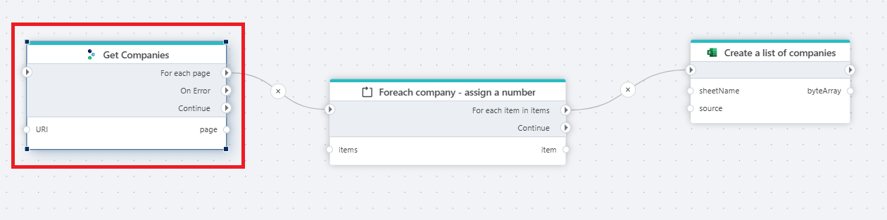

# REST API Request with paging

Use Tripletex REST [APIs (v2)](https://tripletex.no/v2-docs/) to read paged data.  

The **REST API Request with Paging** action allows you to use the [Tripletex](https://tripletex.no/v2-docs/) REST APIs to retrieve large, paginated datasets. This action simplifies working with endpoints that return multiple pages of data, such as lists of customers, invoices, or accounting records. Pagination is handled automatically, allowing you to focus on processing the data.  

  
 

## Properties

| Name            | Type     | Description                                                                                   |
|----------------- | -------- | --------------------------------------------------------------------------------------------- |
| Title           | Optional | The title or name of the request.                                                             |
| Connection      | Required | The Tripletex Connection used to make an authenticated request to Tripletex REST API.         |
| Configuration   | Required | Specifies the HTTP request to the Tripletex API, including the HTTP method, URL, parameters, and return type. |
| Start index     | Optional | The starting point of the index for data retrieval. Defaults to 0 if not specified.           |
| Items per page  | Optional | The number of items to retrieve per page. Defaults to 5000 if not specified.                  |
| Max page count  | Optional | The maximum number of pages to fetch. Defaults to 9999 if not specified.                      |
| Description     | Optional | Additional notes or comments about the action or configuration.                               |

## Returns  

The return type for Tripletex API actions is defined during configuration. It can be either:  
- A **custom data type**, or  
- The raw JSON response from the API.  

For simplicity and debugging, it’s recommended to use the built-in `HttpResponse<T>` type. This includes additional information, such as the HTTP status code, ensuring compatibility with Tripletex API responses.  

To process the data effectively:  
1. Store the raw response in a data repository (e.g., database or cloud storage).  
2. Transform the stored data using tools like SQL, Python, or data transformation pipelines.  

 

## Configuration  

### Setting Up a Request  

Requests to the Tripletex API can be defined manually or by using predefined templates.  

#### Steps for Manual Configuration:  
1. **Method**: Specify the HTTP method (`GET`, `POST`, `PUT`, `DELETE`, etc.). Use `GET` for retrieving data.  
2. **URI**: Define the endpoint URL (e.g., `v2/project` or `v2/customer`). Pass required parameters (e.g., IDs) as query parameters or in the request body.  
3. **Headers and Authorization**:  
   - Authentication is automatically set up from the connection settings.
   - Ensure proper encoding of any additional headers.  
4. **Response Type**: Use `HttpResponse<string>` by default for raw JSON responses. For large responses, this minimizes memory usage and improves performance.  

For endpoint-specific details, refer to the [Tripletex API documentation](https://tripletex.no/v2-docs/).  

 

## Response Paging  

Tripletex APIs often return paginated responses for large datasets. For example, list endpoints like `v2/project` or `v2/customer` include pagination metadata (e.g., `next`, `totalCount`).  

To handle paging:  
- Use the `next` link from the API response to fetch subsequent pages.  
- Repeat until no further pages are available.  

Ensure your API client or workflow can handle this iterative process effectively.  

 

## API Limits  

Tripletex enforces rate limits to manage server load. If you exceed these limits, the API will return a `429 Too Many Requests` error. The action has a built-in retry mechanism (three retries).  

### Best Practices for Handling API Limits:  
- Implement additional retry mechanism.  
- Optimize queries to fetch only necessary data.  
- Monitor API usage to avoid hitting the limit during peak periods.  

For more information, visit the [Tripletex API documentation](https://tripletex.no/v2-docs/).  

By following these guidelines, you can integrate with the Tripletex API efficiently and avoid common pitfalls.
