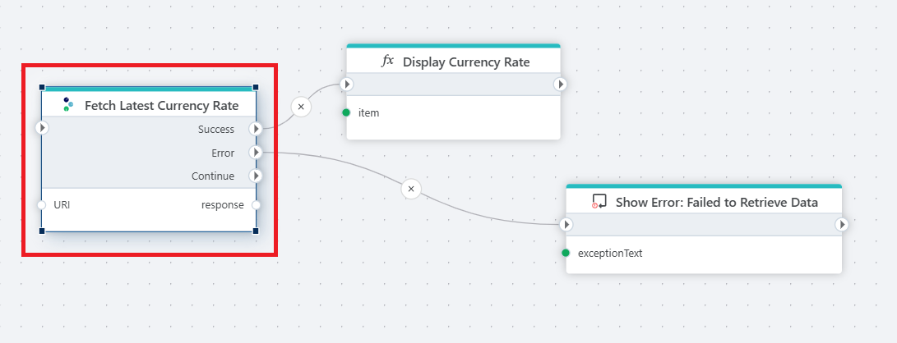

# Rest API Request

Use [Tripletex](https://tripletex.no/v2-docs/) REST APIs to read or write data.

  
 

## Properties

| Name          | Type     | Description                                   |
| ------------- | -------- | ----------------------------------------------- |
| Title  | Optional  |  The title or name of the request.      |
| Connection    | Required | The Tripletex Connection used to make an authenticated request to Tripletex REST API. |
| Configuration | Required | Specifies the HTTP request to the Tripletex API, including the HTTP method, URL, parameters and return type.                                                                                                             |
| Description | Optional | Additional notes or comments about the action or configuration. |

