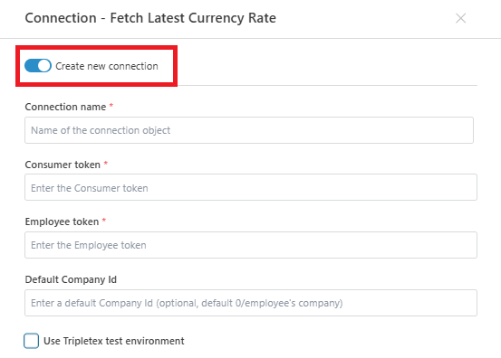

# Connecting to Tripletex

To perform actions with [Tripletex](https://tripletex.no/viktig-informasjon/api/) in Profitbase Flow, you need to configure a connection. You can either select an **existing connection** or create a new one at the action level.

This connection allows Flow to authenticate and interact with the Tripletex API on your behalf using consumer and employee tokens.

 

## Connection properties

A Tripletex connection requires the following fields:

| Property                          | Description |
|----------------------------------|-------------|
| Connection Name                  | A custom name for the connection object. |
| Consumer token                   | A token that authenticates the registered API consumer. |
| Employee token                   | A token that identifies the employee on whose behalf the API calls are made. |
| Default company Id               (optional) | The ID of the company to use by default in requests. |
| Use Tripletex test environment   (optional) | Enable this to use the Tripletex sandbox environment for testing. |

 

## How to Create a Connection

1. Add a Tripletex action to your Flow.
2. In the **Connection** dropdown, click **Create new connection**.
3. Fill in the required fields (tokens can be obtained from the Tripletex developer portal).
4. (Optional) Check the test environment box for sandbox testing.
5. Click **OK** to save the connection.

 

## Screenshot

 

## Dynamic Connection

A [Dynamic Connection](./create-connection.md) can override this default configuration at runtime.  
Use this when credentials or company contexts are retrieved dynamically from other sources during flow execution.

 

## Related Resources

- [Tripletex API documentation](https://tripletex.no/viktig-informasjon/api/)
- [Create Dynamic Tripletex Connection](./create-connection.md)