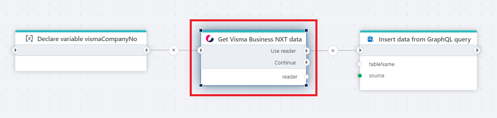

# Get Visma Business NXT data

Gets data from [Visma Business NXT API](https://docs.vismasoftware.no/businessnxtapi/) using GraphQL.

This action gets data from Visma Business NXT using a GraphQL query and returns the result as a stream of rows through an  [IDataReader](https://learn.microsoft.com/en-us/dotnet/api/system.data.idatareader).  

The stream can then be piped to a destination, for example a SQL Server table using the [Insert data](../../sql-server/insert-data.md) action.

## Properties

| Name             | Type      |Description                                             |
|------------------|-----------|--------------------------------------------------------|
| Connection       | Required  | The [Visma Open Id connection](./connection.md). You need to specify the `Client Id`, `Client secret` and the `Customer Id`. You can find these values in the Visma developer portal. |  
| Dynamic connection | Optional | Use this option of you needs to use a connection from the [Create Connection](./create-connection.md) action. |
| GraphQL configuration | Required | Lets you define the GraphQL query, GraphQL query variables and the data definition format of the rows returned from the GraphQL query. |  

 

### GraphQL configuration

The following describes the GraphQL configuration setup.  

##### GraphQL Expression Required

Defines the GraphQL query used to fetch data. You can get started quickly by clicking `Create from template` and use it as a starting point.  

##### Variables (optional)

If the query is parameterized (which it usually is), you need to map the parameters in the query to variables.  

##### Item type mapping Required

The `Item type mapping` describes the data definition of the entities returned from the GraphQL query. You need to specify the data type (String, Integer, DateTime, etc) of each field that you want to include from the query, so Flow can convert it to objects that can be used by subsequent actions.  