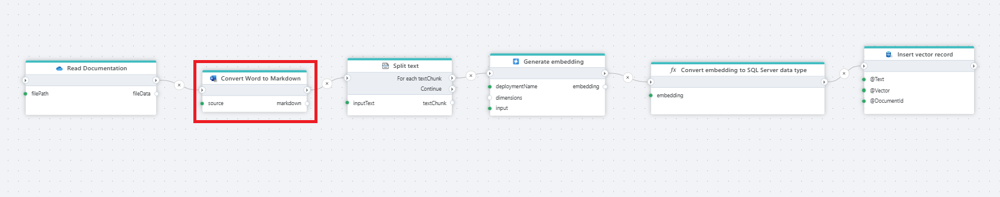

# Convert a Word file to Markdown

Converts a Word file to [Markdown](https://en.wikipedia.org/wiki/Markdown).

**Example**   
This Flow reads a documentation (Word file) from [OneDrive](../onedrive/read-file-from-onedrive-as-byte-array.md), converts it to Markdown, [splits the text](../ai/split-text.md) into chunks, [generates embeddings](../azure-openai/generate-embedding.md) for each chunk, converts them to a SQL Server-compatible format, and stores both the text and embeddings as vector records in SQL Server. It enables efficient semantic search and retrieval of Word document content.

 

## Returns

This action returns a string/text in markdown format.

 

## Properties

| Name                 | Type     | Description                                                                                                   |
| -------------------- | -------- | ------------------------------------------------------------------------------------------------------------- |
| Title                | Optional |   The title of the action.                    |
| File Data            | Required | Specifies the source of the Word file, which can either be a Stream or a Byte Array.                          |
| Result variable name | Required | The name of the variable in which the result will be stored.  |
| Description          | Optional | Additional notes or comments about the action or configuration. |

 

