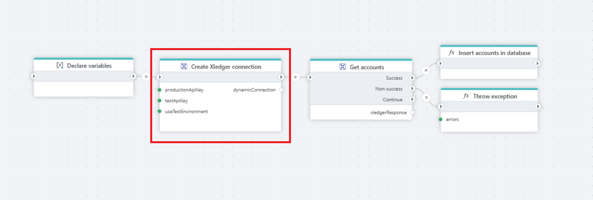

# Create Connection 

This node enables the dynamic generation of an Xledger connection, allowing seamless integration with the Xledger API.

## Properties

| Name                  | Type      | Description                                                              |
|-----------------------|-----------|--------------------------------------------------------------------------|
| Title                | Optional  | The title or name of the connection.                                    |
| Production API key   | Required  | The Xledger API key for the Production environment.                     |
| Test API key        | Optional  | The Xledger API key for the Test environment.                           |
| Use Test environment | Optional  | Specifies whether to use the Test or Production environment.            |
| Connection variable name | Optional  | The variable name used to reference this connection.               |
| Description         | Optional  | Additional notes or comments about the action or configuration.         |

