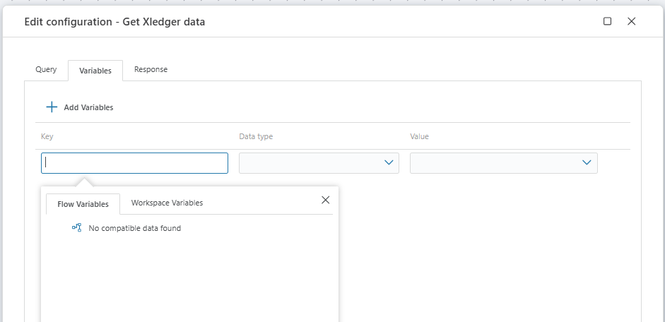

# Get Xledger Data

Gets data from Xledger using GraphQL.

## Properties

| Name            | Type      | Description                                                 |
|-----------------|-----------|-------------------------------------------------------------|
| Title           | Optional  | The title or name of the command.                           |
| Connection      | Required  | [The Xledger connection](./connecting-to-xledger.md).       |
| Configuration   | Required  | Settings or parameters necessary for data retrieval.        |
| Description     | Optional  | Additional notes or comments about the action or configuration. |

## Configuration

