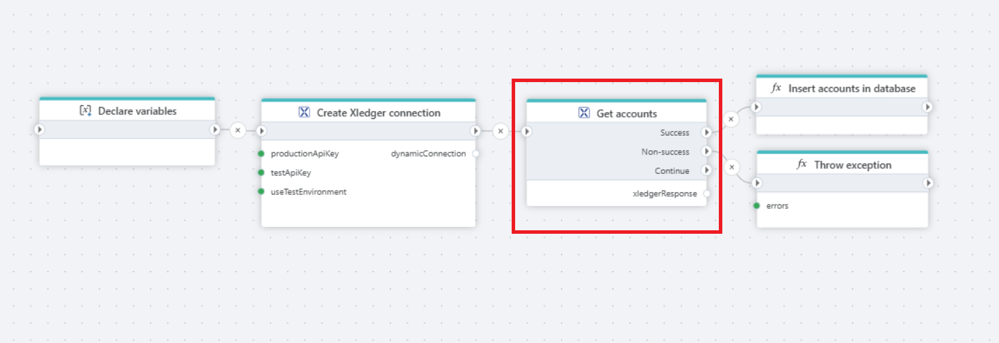

# Get Xledger Data

Gets data from Xledger using GraphQL.

## Properties

| Name                  | Type      | Description                                                              |
|-----------------------|-----------|--------------------------------------------------------------------------|
| Title                | Optional  | The title or name of the command.                                       |
| Connection           | Required  | [The Xledger connection](./connecting-to-xledger.md).                   |
| Use dynamic connection | Optional  | Allows selection of the connection to be used. It can be either the connection from the **Connection** property or a previously defined [dynamic connection](create-connection.md). |
| Configuration        | Required  | Settings or parameters necessary for data retrieval.                     |
| Description          | Optional  | Additional notes or comments about the action or configuration.         |

## Configuration

