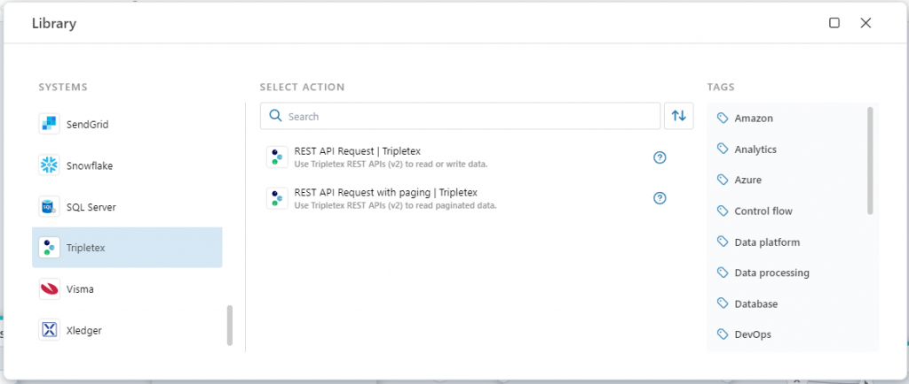
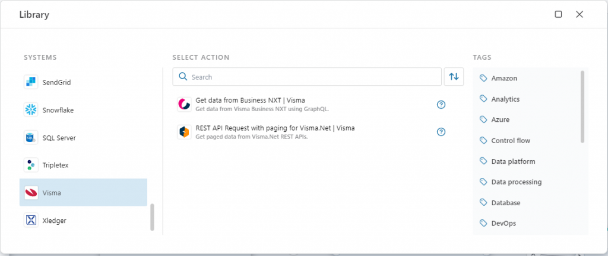
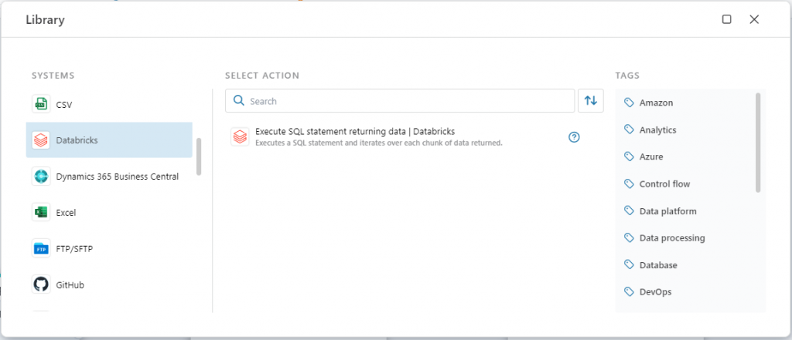
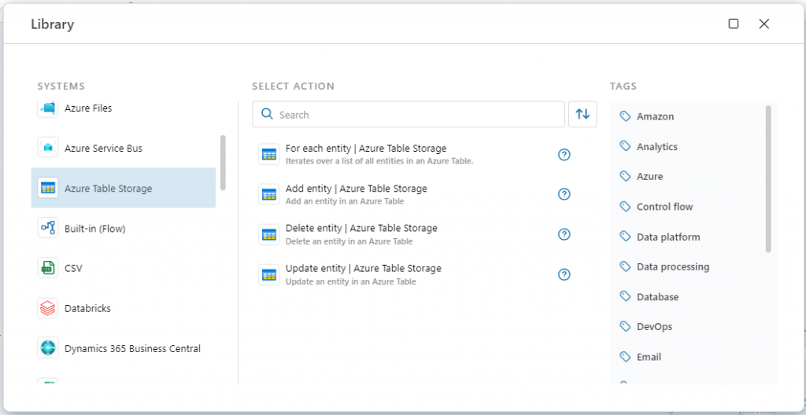
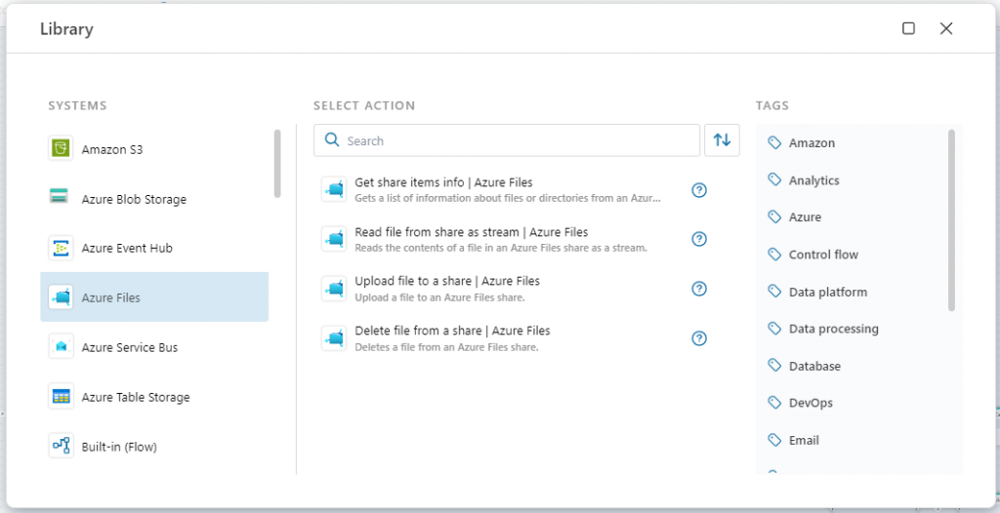
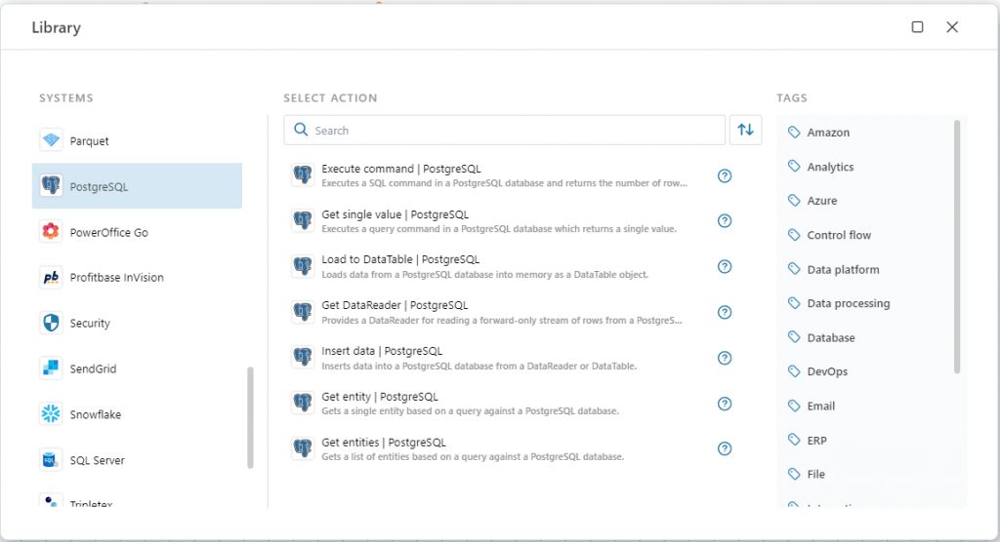
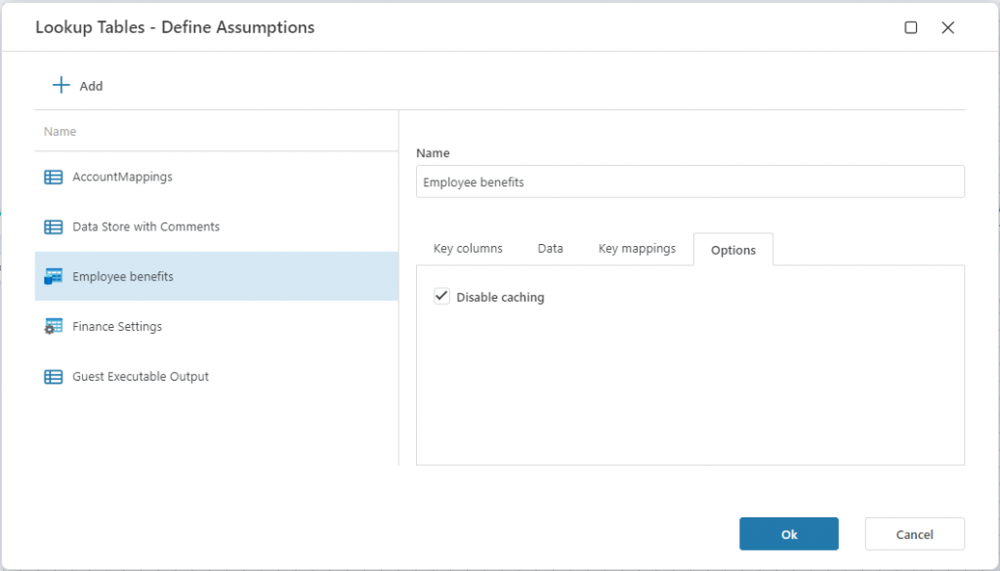

# December 2024 Update


New version of Flow with support for more systems and features to simplify and automate data integrations and business processes. In this release we added support for TripleTex, Visma.Net, Databricks, Azure Table Storage, and Azure Files. In addition, we’ve added new features for PowerOffice Go, Microsoft Fabric, PostgreSQL, and Profitbase InVision.

## TripleTex
Profitbase Flow now has a built-in connector for the TripleTex REST API. The connector handles authentication, paging, faults, and throttling (API quotas), simplifying data integrations with TripleTex.  
Read more here: [**TripleTex REST API**](../actions/tripletex/rest-api-request.md) | [**TripleTex REST API for paginated response**](../actions/tripletex/paged-rest-api-request.md)




## Visma.Net
We now support the Visma.Net REST API to retrieve large, paginated datasets. This action simplifies working with APIs that return multiple pages of data, such as lists of customers, invoices, or accounting records. Pagination is handled automatically, allowing you to focus on the business logic instead of infrastructure.  
Read more here: [**REST API with paging**](../actions/visma/visma-net/paged-rest-api-request.md)




## PowerOffice Go
We’re extending our PowerOffice Go REST API support to automatically handle paged result sets. This simplifies working with APIs that return multiple pages of data, such as lists of customers, invoices, or general ledger records.  
Read more here: [**REST API request with paging**](../actions/poweroffice-go/paged-rest-api-request.md)

## Databricks
Flow now supports the [**Execute SQL statement API**](https://docs.databricks.com/api/azure/workspace/statementexecution/executestatement) in Databricks. This enables easy integration with Databricks for querying data and executing SQL statements on a SQL warehouse.




## Azure Table Storage
The December 2024 update of Flow introduces support for [Azure Table Storage](https://learn.microsoft.com/en-us/azure/storage/tables/table-storage-overview), a service that stores non-relational structured data in the cloud. It provides a key/attribute store with a schemaless design. Access to Table storage data is fast and cost-effective for many types of applications, and is typically lower in cost than traditional SQL for similar volumes of data.

We support the following Azure Table Storage actions:

- [**For each table entity**](../actions/azure-table-storage/foreach-table-entity.md) – Enables iterating over a list of entities.
- [**Add table entity**](../actions/azure-table-storage/add-table-entity.md) – Adds an entity to an Azure Table.
- [**Update table entity**](../actions/azure-table-storage/update-table-entity.md) – Updates an existing Azure Table entity.
- [**Delete table entity**](../actions/azure-table-storage/delete-table-entity.md) – Deletes an entity from an Azure Table.




## Azure Files
[Azure Files](https://learn.microsoft.com/en-us/azure/storage/files/storage-files-introduction) makes it easy to share files between cloud and on-premise servers and services. Flow now supports Azure Files through the following actions:

- [**Get share items info**](../actions/azure-files/get-share-items-info.md) – Returns a list of files and folders in an Azure Files share.
- [**Read file from share as stream**](../actions/azure-files/read-file-as-stream.md) – Reads a file from an Azure Files share.
- [**Upload file to a share**](../actions/azure-files/upload-file.md) – Uploads a file to an Azure Files share.
- [**Delete file from a share**](../actions/azure-files/delete-file.md) – Deletes a file from an Azure Files share.




## Microsoft Fabric
- **Create Workspace**  
  This action enables teams and organizations to automatically provision Fabric Workspaces on-demand without having to use the Fabric portal to create them manually.  
  [Read more here](../actions/microsoft-fabric/create-workspace.md).

- **Load Lakehouse table**  
  The [Lakehouse](https://learn.microsoft.com/en-us/fabric/data-engineering/lakehouse-overview) in Microsoft Fabric provides a feature to efficiently load common file types to an optimized Delta table ready for analytics. The **Load Lakehouse table** action allows users to load a single file or a folder of files to a table.  
  [Read more here](../actions/microsoft-fabric/load-lakehouse-table.md).

## PostgreSQL
We’ve extended the support for PostgreSQL with new actions to improve developer productivity for typical application development scenarios, where working with business entities is more common than working with large datasets.

- **Get single value**  
  Enables running a query that returns a single value, e.g., counting the number of rows in a table.

- **Get entity**  
  Enables running a query that returns a (business) entity, e.g., a customer object.

- **Get entities**  
  Enables running a query that returns a list of (business) entities, e.g., all customers.





## Profitbase InVision
The December 2024 update of Flow adds support for the following new InVision integrations:

- [**Execute InVision Dataflows from Flow**](../actions/profitbase-invision/execute-dataflow.md) – This feature makes it easier to gradually migrate business logic from InVision Dataflows to Flow.
- Lookup, Distribution Keys, and Auto Transaction tables – Now includes an option to **disable caching**. This feature is useful when data is always generated into a table by a script instead of coming from user input. By enabling this option, you don’t have to use the [**Remove InVision object from cache**](../actions/built-in/remove-invision-object-from-cache.md) action for tables where data is generated from custom code.





## JSON
The new [**Get JSON DataReader**](../actions/json/get-json-datareader.md) action makes it easy to write JSON data to a relational database table as rows and columns, or convert JSON into other tabular formats such as Excel or Parquet files. This feature is particularly useful when creating integrations to REST APIs (such as ERP systems), which return JSON that can be represented as rows and columns.

## Data Analysis APIs
The December 2024 update introduces the initial version of programming APIs for doing data analysis and manipulation tasks in Flow. These APIs are intended for advanced scenarios (or when you simply want to write code instead of using drag-and-drop) and offer a way to manipulate data using code.  
Read more here: [**DataTable transformer**](../api-reference/data-analysis/datatable-transformer/datatable-transformer.md) | [**JsonDataReader**](../api-reference/data-analysis/json/json-data-reader/json-data-reader.md)

```csharp
DataTable dataTable = ... // load the data table.

dataTable.UseTransform()
    .FillMissingValues("Age", FillMethod.Average)    
    .MergeColumns(["City", "Street"], "Address", separator: ", ")
    .ForEachRow(row =>
    {
        row["Name"] = row["Name"].ToString().ToUpper();
    })
    .AddColumn("AgeInMonths", "int")
    .ComputeColumn("AgeInMonths", row =>
    {
        var age = (int)row["Age"];
        return age * 12;
    })
    .RenameColumn("dob", "DateOfBirth")
    .RemoveColumn("email");
```

<br/>

### See Also

- [October 2024](changelog24_october.md)
- [September 2024](changelog24_september.md)
- [August 2024](changelog24_august.md)