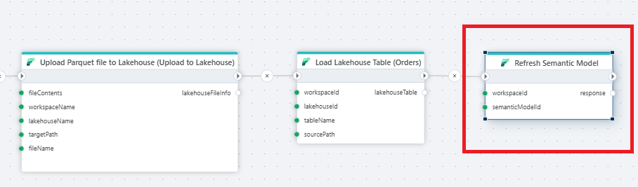
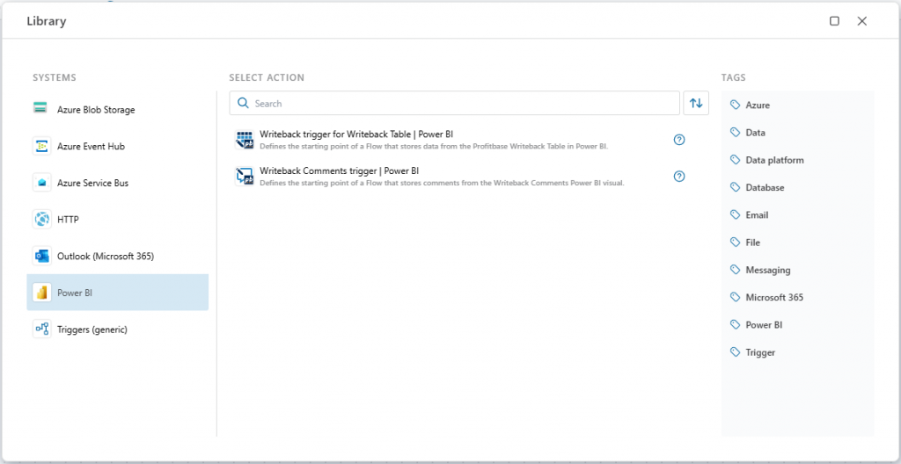
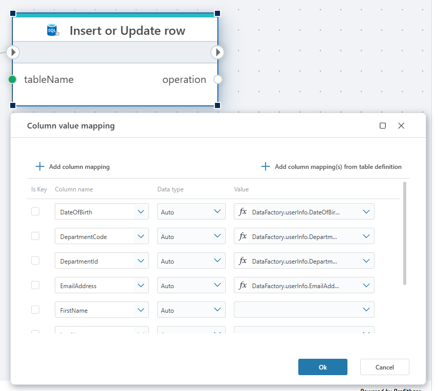
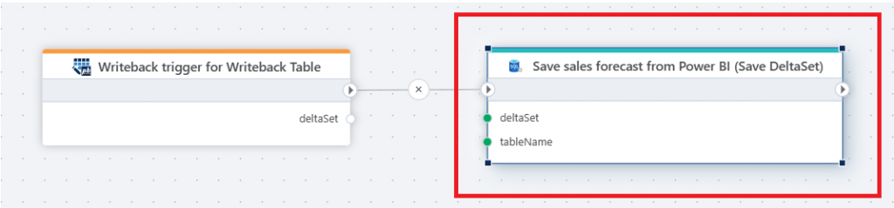
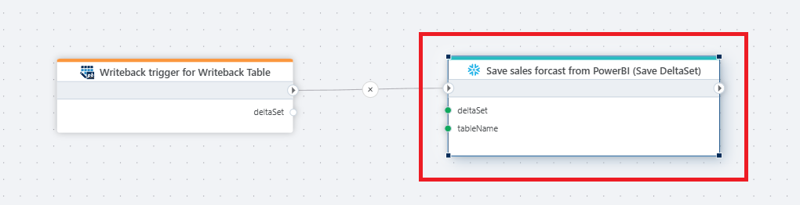
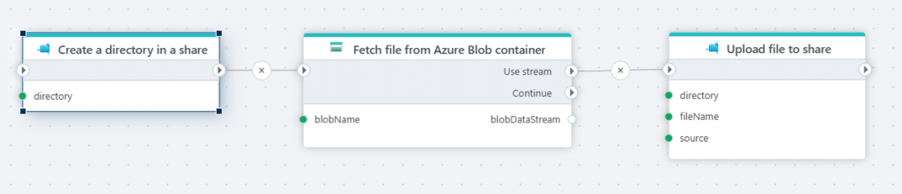
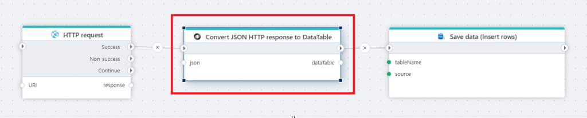
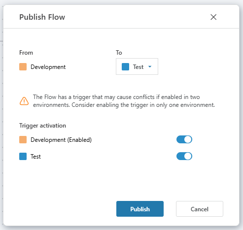
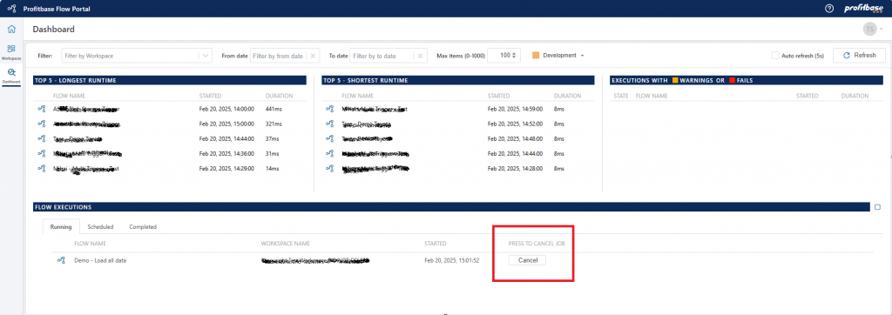

# February 2025 Update  

February 2025 update of Profitbase Flow, introducing new features and enhancements across various integrations and functionalities.

## Microsoft Fabric

**Refresh Semantic Model**

You can now refresh of a semantic model in Microsoft Fabric directly from Flow instead of using a Fabric Data Pipeline. You can configure the operation be “fire-and-forget”, or wait for the refresh to complete before the next action in the Flow is executed.

*Read more here: [Refresh Semantic Model](../actions/microsoft-fabric/refresh-semantic-model.md)*

## Power BI Triggers

**Writeback Trigger for Writeback Table**

The Writeback Table visual for Power BI enables editing data within Power BI. Use this trigger to initiate a Flow that saves changes to your preferred database or service, such as Azure SQL Database or Snowflake.

**Writeback Comments Trigger**

The Writeback Comments visual for Power BI allows users to add comments to reports, report lines, KPIs, or data points, and save them to a database or service. This trigger starts a Flow that saves these comments to your chosen destination. Use this trigger to define the starting point of a Flow that saves the comments to the preferred database or service, for example Azure SQL database or Snowflake.

## SQL Server

**Insert or Update Row**

Previously, inserting or updating a row in a SQL Server database required writing SQL code using the [Execute Command](../actions/sql-server/execute-command.md) action. The new Insert or Update Row action simplifies this process, allowing you to define which row to update by specifying columns and associated values without writing any code.

*Read more here: [Insert or update row](../actions/sql-server/insert-or-update-row.md)*

**Save DeltaSet**

When users edit data in the [Writeback Table](../../PowerBI/writeback-table/overview.md) for Power BI and save the changes, the modifications are represented as a Flow DeltaSet. This action saves all changes in the DeltaSet by inserting, updating, or deleting rows in a SQL Server or Azure SQL table.

*Read more here: [Save DeltaSet](../actions/sql-server/save-deltaset.md)*

## Snowflake

**Save DeltaSet**

Similar to SQL Server, when users edit data in the [Writeback Table](../../PowerBI/writeback-table/overview.md) for Power BI, the changes are represented as a Flow DeltaSet. This action saves all modifications by inserting, updating, or deleting rows in a Snowflake table.

*Read more here: [Save DeltaSet](../actions/snowflake/save-deltaset.md)*

## Parquet

**Support for Dynamic Column Mappings**

You can now provide dynamic column mappings to Parquet actions. This is useful when the schema of a Parquet file is unknown at design time, and you don't want to read all columns from the file.

**Optional Column Mapping**

Providing a column mapping is no longer necessary when using Parquet actions that read files, such as the [Open Parquet File as DataReader](../actions/parquet/open-parquet-file-as-datareader.md) action. Specify a column mapping only if you wish to rename columns during the read operation or ignore certain columns from the file.

## CSV

**Optional Column Mapping**

Column mapping is now optional when using CSV actions that read files, such as the [Open CSV File as DataReader](../actions/csv/open-csv-file-as-datareader.md) action. If you don't specify a column mapping, ensure the first line in the CSV file is a header row containing the column names, and all fields will be read as text.

## Profitbase InVision

The SQL and PowerShell script actions now support parameterization of which scripts to execute, in addition to selecting specific scripts. This enhancement enables the creation of generic Flows capable of executing any SQL or PowerShell script in InVision.

## Azure Files

**Create Directory in a Share**

This action creates a directory in an Azure Files share if it does not already exist, enabling dynamic directory creation during Flow execution.

*Read more here: [Create directory](../actions/azure-files/create-directory.md)*

**Delete Directory in a Share**

This action deletes a directory if it exists, allowing for dynamic directory deletion within an Azure Files share during Flow execution.

**Read File from Share as Byte Array**

This action enables reading a file as a byte array instead of as a stream. Since a stream can only be read once, reading the file as a byte array is beneficial when you need to process the same file multiple times in the Flow. If processing the file only once, prefer using the stream option; for multiple processes, the byte array option is recommended.

*Read more here: [Read file from share as byte array](../actions/azure-files/read-file-as-byte-array.md)*

## OneDrive

**Read File from OneDrive as Byte Array**

This action enables reading a file as a byte array instead of as a stream. Because a stream can only be read once, reading the file as a byte array is useful when you need to process the same file multiple times in the Flow. If you only need to process the file once, prefer using the stream option. If you need to process the file multiple times, prefer the byte array option. 

*Read more here: [Read file from OneDrive as byte array](../actions/onedrive/read-file-from-onedrive-as-byte-array.md)*

## JSON

**Convert JSON to DataTable**

We’ve added support for converting a JSON string to a .NET DataTable, which makes it easy to work with JSON (for example from web APIs) that can be represented in a table format. With the DataTable, you can apply a series of data transformations using for example the DataTableTranformer API in Flow.

*Read more here: [DataTableTranformer](../api-reference/data-analysis/datatable-transformer/datatable-transformer.md)*

## Dynamic connections

Dynamically creating connections to systems (like ERP or databases) enables storing credentials and connection strings outside of Flow. It also enables actions to dynamically connect to different endpoints during the execution of a Flow, for example in a loop where you might want to connect to different databases based on a variable.

The systems currently supporting dynamic connections are:

- Azure Blob containers
- SQL Server
- Visma.Net
- Visma Business NXT
- Xledger
- Dynamics 365 Business Central
- TripleTex
- PowerOffice GO

## Option to disable trigger when publishing a Flow

If a Flow has a trigger, you now get an option to disable the trigger in one of the environments when publishing the Flow. This only applies to triggers that reacts to events in external systems, or triggers that run on a schedule. Endpoint triggers, such as the HTTP trigger, is not affected by this behavior.

## Cancellation of jobs from the dashboard

You can now cancel running jobs from the dashboard. When cancelling a job, a cancellation request is sent and the job will stop at first chance. Depending on what task the job is currently performing, the job may stop immediately, or it might take several seconds or minutes to stop.

### See Also

- [December 2024](changelog24_december.md)
- [October 2024](changelog24_october.md)
- [September 2024](changelog24_september.md)
