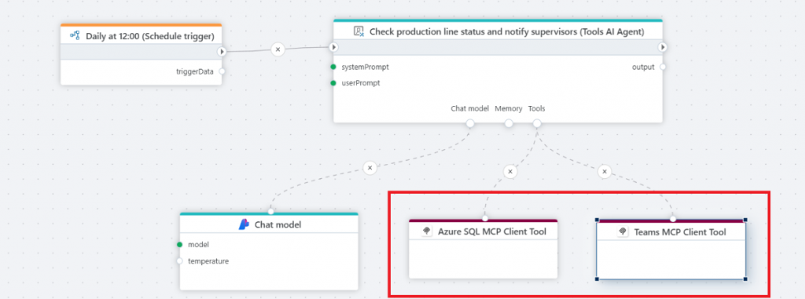
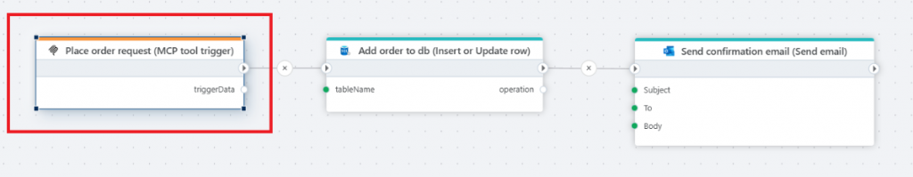
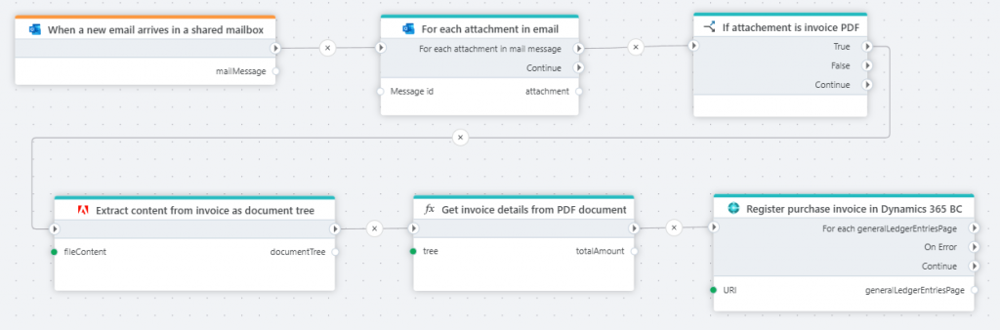
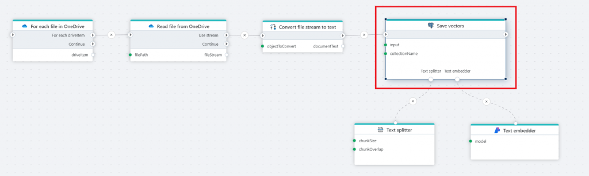
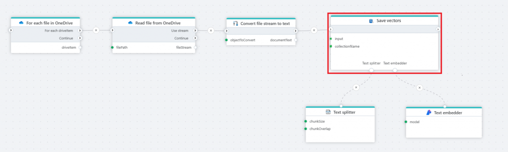
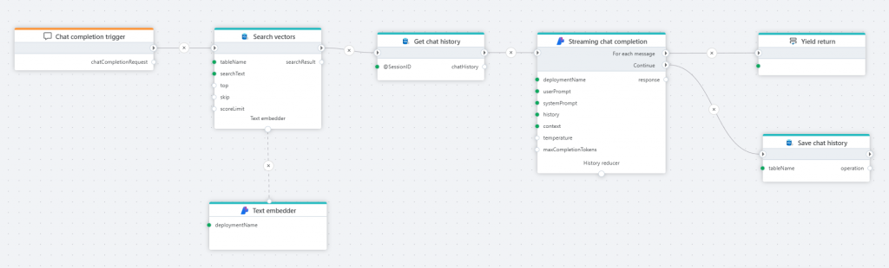
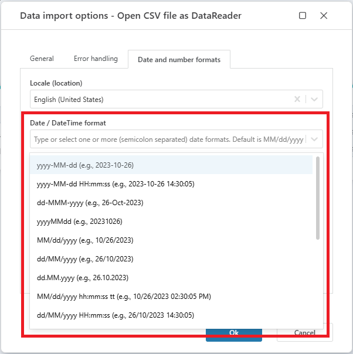
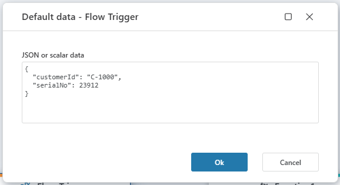
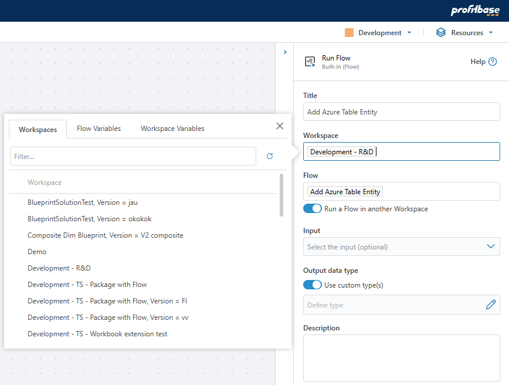
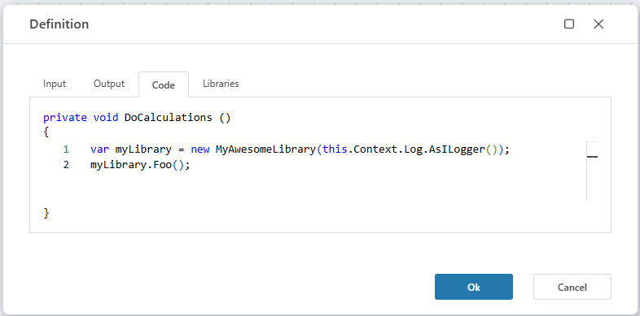

# June 2025 Update

The June 2025 release expands the toolbox for building AI-powered solutions with support for the **[Model Context Protocol (MCP)](https://modelcontextprotocol.io/docs/getting-started/intro)**, the ability to use SQL Server and Azure SQL Database as vector stores, and additional Adobe PDF Services APIs for ingesting, extracting, and processing information from PDF files.

Support for Model Context Protocol (MCP) enables finances and operations teams to build AI agents and agentic workflow automations with Flow. Combined with the extensive library of ERP, database and service connectors, finance and operation teams can now create AI-powered agents that automate dataflows between systems, enforces business rules, analyzes information, and eliminates manual work.

 

## Model Context Protocol (MCP)

You can now build and integrate **AI agents** with Flow, using the **Model Context Protocol (MCP)**. MCP is an open standard that defines how large language models (LLMs) interact with tools, systems, and data sources—transforming them from passive chat interfaces into active agents capable of taking actions.

With Flow, MCP enables:

- Building AI agents directly in Flow using internal and external tools
- Using Flow-based tools from external AI agents, including Microsoft 365 Copilot
- Context-aware, multi-step AI workflows integrated into business processes

### MCP client tool

- Allows AI agents in Flow to interact with external systems via MCP servers
- Combine 1st-party and 3rd-party MCP tools in one agent

The image below shows an AI agent that runs periodically, uses tools from two MCP servers to check the production line status, and notify users if actions need to be taken. With the MCP client tool, you can now use Flow to build AI agents that uses both 3rd party AI tools, and the tools developed by you.

[Read more here](../actions/mcp/mcp-client-tool.md)

 

### MCP tool trigger

- Exposes a Flow as an MCP-compatible AI tool
- Enables LLMs to invoke entire Flows as tools within agentic workflows

[Read more here](../triggers/mcp/mcp-tool-trigger.md)

 

## Adobe PDF Services

Flow now includes extended support for **Adobe PDF Services**, including new actions for extracting structured content and converting files to and from PDF format. These features streamline workflows involving document ingestion and processing.

### Extract PDF content

- Extracts content as:
  - Byte array
  - Stream
  - JSON
  - Document tree (object model)
- Use case: Processing invoice or order PDFs received via email and routing data into ERP systems

[Read more about extraction to document tree here.](../actions/adobe/extract-content-from-pdf-as-object-tree.md)
[Read more about extraction to byte array here.](../actions/adobe/extract-content-from-pdf-as-byte-array.md)
[Read more about extraction to JSON here.](../actions/adobe/extract-content-from-pdf-as-json.md)

 

### Convert to PDF

We support converting non-PDF to PDF files using [Adobe PDF Services](https://developer.adobe.com/document-services/docs/overview/pdf-services-api/).

- Convert Word, Excel, PowerPoint, or image files to PDF
- Ideal for automating report or document generation for sharing with external stakeholders

[Read more here](../actions/adobe/pdf-to-non-pdf-as-stream.md)

 

## PostgreSQL

### Save Vectors

- Automatically splits documents, generates embeddings, and stores them in PostgreSQL
- Updates existing entries on rerun for up-to-date vector stores

[Read more here](../actions/sql-server/vector-save.md)

 

### Search Vectors – Metadata & Prompt Templates

- Return metadata with search results for use in LLM prompts
- Supports **custom prompt templates** to improve control over LLM behavior

[Read more here](../actions/postgresql/vector-search.md)

 

### Insert or Update Row

- New action to insert or update rows in PostgreSQL without custom SQL

[Read more here](../actions/postgresql/upsert-row.md)

 

## SQL Server / Azure SQL

Although vector support is still in preview, we’re staying ahead by enabling the use of SQL Server / Azure SQL as a vector database for AI workloads. With the **Save Vectors** and **Search Vectors** actions, using SQL Server or Azure SQL as a vector store for semantic search is now easy in Flow.

### Save Vectors

- Splits documents and stores vectorized chunks in SQL Server / Azure SQL
- Automatically updates vectors on rerun

The Flow below illustrates how to create a knowledge database from files stored in SharePoint (OneDrive), and make the information available to AI agents or users via semantic search or AI chats. For example, let users use natural language chats to get information about product specs, marketing plans, HR handbooks and tender responses.

[Read more here](../actions/sql-server/vector-save.md)

 

### Search Vectors

- Enables semantic search with SQL input
- Used for **RAG** *(retrieval augmented generation)* scenarios with internal documents

[Read more here](../actions/sql-server/search-vectors.md)

 

## Core

### Snowflake – Schema in Table Selector

The table selector now includes the schema so you don’t have to specify it manually if there is a naming conflict or you want to run cross-schema queries.

 

### Log Action

- New built-in **Log** action for inline logging
- No need for a separate Function action to log messages

[Read more here](../actions/built-in/log.md)

 

### CSV – Date Format Picker

- Improved UI for selecting date formats during CSV import
- Supports common formats and custom strings

 

### JsonDataReader

- Now supports:
  - Random order schema mappings
  - Automatic numeric-to-string conversions
  - Improved error messaging with field-level context

[Read more about Get JSON DataReader](../actions/json/get-json-datareader.md)  
[Read more about the JsonDataReader API](../api-reference/data-analysis/json/json-data-reader/json-data-reader.md)

 

### Flow Trigger – Default Data

The Flow trigger now has support for defining a default data payload. Defining default data serves two main purposes:

- Simplify development by defining the test data to use during development.
- Define the default data to use if the caller Flow does not provide any data as input. Note that you should only do this if this behavior is intended. If null is a valid input, then remove the default data when development / testing is done.

The Default data definition must be a valid JSON value, meaning it can be a primitive type such as a string or number, or a complex JSON object.

 

### Run Flow (nested execution) – streaming support

Nested execution now supports streaming data from the callee to the caller Flow. This means that the caller Flow can start processing data as it becomes available, instead of having to wait until the callee Flow has finished processing the entire request.

### Run Flow (nested execution) – support for running Flows in other Workspaces

You can now run Flows in other Workspaces when using the Run Flow action. You can either specify the Workspace (and Flow) to run explicitly, or use parameterize both properties.

 

### Log.AsILogger() – API for logging from extension libraries

- API for logging from extension libraries such as Financials
- Helps communicate calculations, assumptions, and decisions in custom logic

When developing extension libraries to Flow (such as the Financials library), being able to write messages to the Flow log from within the library is often useful. These types of messages can range from debug messages used during development, to user-intended messages that describes what the library actually does. Providing insights into what mathematical or financial models does, and which parameters are used, makes the outcomes understandable and easier to interpret, evaluate, and trust.

 

## See Also

- [May 2025](changelog25_may.md)
- [February 2025](changelog25_february.md)
- [December 2024](changelog24_december.md)
- [October 2024](changelog24_october.md)
- [September 2024](changelog24_september.md)

