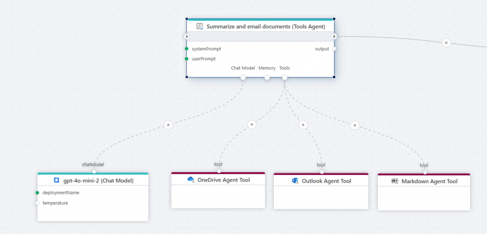
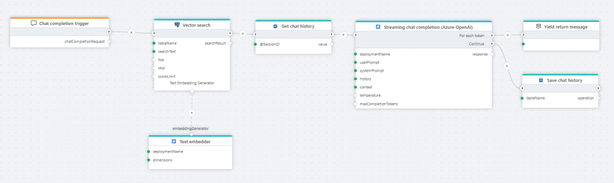

# May 2025 Update  

We are excited to release the first version of Flow with support for **AI workloads** powered by **Azure** and **OpenAI**! This AI-centered release focuses on:

- Accessing information in business documents through **semantic search**, **AI chat**, and **AI agents**
- Building document stores for **RAG (Retrieval-Augmented Generation)** and **semantic search**
- Creating **AI chat clients**
- Automating tasks with **AI agents**

 

## Adobe PDF Services

Flow now integrates **Adobe PDF Services** to easily convert PDF files into:

- Word (.docx)
- Excel (.xlsx)
- PowerPoint (.pptx)
- RTF (.rtf)

PDF files need to be converted into machine-readable formats (e.g., Markdown) to be usable by LLMs and other information retrieval systems. You can combine the Adobe PDF Services converter action with a Markdown converter action for optimal compatibility.

 

## AI Tools Agent

The **Tools AI Agent** allows for autonomous AI-powered automations. Example:

- Gather data from internal systems
- Compose a report
- Post the report to Microsoft Teams

> The LLM-powered "brain" decides which tools to use and how to execute the task.

[Read more here](../actions/agents/tools-ai-agent.md)

  

## AI Agent Tools

Tools enables building AI-powered automations using [AI Agents](../actions/agents/tools-ai-agent.md) that, given a set of tools, can operate autonomously to complete tasks. These tools help build AI-powered automations:

 

### Azure Storage Blob Agent Tool

- Access Azure Blob Storage
- Read and write files

[Read more here](../actions/azure-blob-storage/agent-tool.md)

 

### OneDrive Agent Tool

- Access OneDrive on behalf of a user
- List, read, upload, and delete files  

[Read more here](../actions/onedrive/agent-tool.md)

 

### Outlook Agent Tool

- Send emails via Outlook  

[Read more here](../actions/microsoft-365-outlook/agent-tool.md)

 

### Markdown Agent Tool

- Convert Word, PowerPoint, PDF, CSV, Excel to Markdown
- Useful for summarizing and interpreting documents

[Read more here](../actions/markdown/agent-tool.md)

 

## AI Chat – Azure OpenAI

### Chat Completion

- Returns a response from an Azure OpenAI chat model (LLM)
- Use case: Chat clients like ChatGPT, reasoning over documents

 

### Streaming Chat Completion

- Streams response as it's generated (ideal for chat backends)

 

### Generate Embedding

- Converts text to embedding vector for vector search or vector store (e.g., SQL Server, PostgreSQL)  

[Read more here](../actions/azure-ai/generate-embedding.md)

 

### Chat Model

- Powers reasoning for tools like [AI Agents](../actions/agents/tools-ai-agent.md) 

[Read more here](../actions/azure-ai/agent-chat-model.md)

 

### Text Embedder

- The Text embedder is a tool used by actions such as the [PostgreSQL Vector](../actions/postgresql/vector-search.md) search action to generate embedding vectors on demand. The action chooses when and if to use the tool.

The difference between the **Text embedder** tool and the **Generate embedding** action, is that the Text embedder tool is used by other actions *if they choose to*, while the Generate embedding action runs explicitly.

 

## AI Chat – OpenAI

Same features as Azure OpenAI:

- [Chat completion](../actions/openai/chat-completion.md)
- [Streaming chat completion](../actions/openai/streaming-chat-completion.md) 
- [Generate embedding](../actions/openai/generate-embedding.md) 
- [Chat model](../actions/openai/agent-chat-model.md) 
- [Text embedder](../actions/openai/text-embedder.md) 

 

## AI Chat – Common

### Chat History Truncation Reducer

- Removes items from chat history before sending to the LLM
- Helps reduce token usage and improve accuracy

The Chat history truncation reducer is used to limit the amount of data processed by an LLM by removing items from the chat history before it is sent as part of the prompt. Reducing the input to an LLM may positively affect the accuracy of the response, and reduce cost because fewer tokens are used.

## PostgreSQL

 

### Search Vectors

This action performs a **vector search** against a PostgreSQL table and returns the matching records. It is typically used when you want to find similar items based on meaning or characteristics, rather than exact matches. Common use cases includes

 - **Semantic search:** Retrieving documents, web pages, or support articles that are semantically similar to a user’s query, even if they don’t share the same keywords.

 - **Recommendation systems:** Suggesting similar products, movies, songs, etc., by comparing vector representations of items and user preferences.

A concrete example for using the vector search action is when building RAG-based pipelines, where you are using an LLM to answer questions or reason about text. For this, you will do a semantic search for the question asked by the user, and then feed the result of the search + the user question to the LLM.

# Markdown

Markdown is a lightweight plain-text formatting language used to create structured documents using simple syntax (e.g., `#` for headings, `*` for bullets, backticks for code). It is easy to read, write, parse, and generate, making it ideal for LLMs and AI-enabled workloads.

The following actions are supported:

#### Convert URL to Markdown
Converts the HTML content of a web page into Markdown format.  
[Read more here.](../actions/http/convert-url-to-markdown.md)

#### Convert HTML to Markdown
Converts HTML to Markdown using the MarkItDown library from Microsoft.  
[Read more here.](../actions/http/convert-html-to-markdown.md)

#### Convert a PDF file to Markdown
Converts a PDF file to Markdown using the MarkItDown library from Microsoft.  
[Read more here.](../actions/pdf/convert-to-markdown.md)

#### Convert an Excel file to Markdown
Converts an Excel file to Markdown using the MarkItDown library from Microsoft.  
[Read more here.](../actions/excel/convert-to-markdown.md)

#### Convert a Word file to Markdown
Converts a Word file to Markdown using the MarkItDown library from Microsoft.  
[Read more here.](../actions/word/convert-to-markdown.md)

#### Convert a PowerPoint file to Markdown
Converts a PowerPoint file to Markdown using the MarkItDown library from Microsoft.  
[Read more here.](../actions/powerpoint/convert-to-markdown.md)

 

# GitHub

We have added support for reading files and file information from GitHub repositories. This enables using Flow for workloads involving pulling resources from GitHub, for example deploying Spark Jobs or Notebooks to Microsoft Fabric as part of deploying data integration solutions.

### For each content info
This action iterates over file and folder information in a GitHub repository. Note that it does not download any files. You will typically use this action to list items, and then conditionally download the ones you are after.  
[Read more here.](../actions/github/for-each-content-info.md)

### Read content as byte array
This action reads a file from GitHub as a byte array (binary format, can be used multiple times).  
[Read more here.](../actions/github/read-content-as-byte-array.md)

### Read contents as stream
This action reads a file from GitHub as a stream (read once, forward only, best performance).  
The difference between reading a file as stream or byte array is that a stream can only be read once. If you need to perform multiple operations on the same file, use the byte array option.  
[Read more here.](../actions/github/read-content-as-stream.md)

 

# HTML

We’ve added basic support for web scraping, which enables automating retrieval of information from web sites for analysis or storing to files or databases.

 

### For each HTML element
This action supports iterating over HTML elements in an HTML document or HTML fragment. You can use this action when doing web scraping to get contents of a web site, and you need to extract data from only specific sections of the web pages.  
[Read more here.](../actions/html/for-each-element.md)

### Replace relative with absolute URLs
This action replaces relative URLs in an HTML document or element with absolute URLs.  
A typical use case for this action is storing information from a website (such as an internal knowledge base) in a vector database used for RAG by an AI chat. Links to topics are often stored as URLs relative to the original site. However, when an LLM replies with information from the RAG lookup, the response is no longer in the context of the original website, so relative links are broken.  
[Read more here.](../actions/html/replace-relative-urls.md)

 

# HTTP

### Get sitemap
This action retrieves the sitemap from a given URL and returns a structured list of entries, including metadata for each page. It is typically used as a starting point for scraping pages on the website.  
[Read more here.](../actions/http/get-sitemap.md)

 

# Vector data

### Split text
The Split text action breaks large blocks of text into smaller, manageable chunks. This is especially useful in natural language processing tasks, where models have input size limits or where splitting improves performance. Text splitters typically aim to preserve semantic meaning by splitting at logical boundaries like sentences or paragraphs.

When using Flow to populate a vector database with text from sources like documents or websites, use the Text Splitter to break large blocks of text into smaller chunks before generating embeddings and storing them in the database.

 

# Chat completion trigger

The Chat completion trigger defines the entry point for a Flow that executes an AI chat completion request.

You’ll typically use this trigger when you want to implement a Flow that serves as the backend for an interactive chat, allowing users to have a conversation with an AI by asking questions and follow-up questions. The trigger also provides a context property, allowing arbitrary data to be passed to the Flow to use for filtering or other types of business logic, supporting features such as RAG to help the LLM generate more relevant responses.  
[Read more here.](../triggers/ai/chat-completion-trigger.md)

 

# JSON

### JsonDataReader – handle arrays
The JsonDataReader API, including the [Get JSON DataReader](../actions/json/get-json-datareader.md) action, now reads array fields as raw strings instead of ignoring them. This feature enables working with JSON data that contains one-to-many relationships, such as transactions and transaction details (like orders and order lines).  
[Read more here.](../actions/json/get-json-datareader.md)

 

# InVision

### Refresh Table artifacts
This action refreshes artifacts associated with InVision Tables.

You must use this action if you modify data in Tables using a [SQL Script](../../invision/docs/sqlscripts.md) or other methods that directly manipulate the database table, instead of using InVision or Flow APIs.  
You don’t have to use this action when updating InVision Tables using the built-in data import APIs or when users update data through the UI.  
[Read more here.](../actions/profitbase-invision/table/refresh-table-artifacts.md)

 

# CSV

### Support for parameterization of CSV export and import options (Advanced)
We now support parameterization of the CSV export and import options (such as row delimiter, quote character, thousand separator, date format string, etc), to enable apps such as Planner to create custom UIs for CSV data export and import jobs.

 

# Core

### Streaming
Profitbase Flow now supports streaming the result back to a client while executing. This enables clients to start processing data as soon as it becomes available, instead of having to wait until the Flow has completed the entire task. A typical use case of this feature is to build AI chat clients, where the response from the LLM is streamed back in chunks as it becomes available.  
[Read more here.](../api-reference/execute-flow/stream.md)

### Yield break
The `yield break` action signals the end of an iteration in an iterator. When a client receives this signal, it knows that no more items are returned.  
[Read more here.](../actions/built-in/yield-break.md)

### Yield return
`Yield return` provides the next value of an iteration in an iterator – in other words, it returns the current chunk of a response. When there is no more data to yield back to the client, `yield break` signals the end of the response.  
[Read more here.](../actions/built-in/yield-return.md)

 

### Run Flow – Parameterizable target Flow
When using the Run Flow action, you can now parameterize which Flow to run, enabling creating more general-purpose and composable Flows.

 

### See Also

- [February 2025](changelog25_february.md)
- [December 2024](changelog24_december.md)
- [October 2024](changelog24_october.md)
- [September 2024](changelog24_september.md)
- [August 2024](changelog24_august.md)