# October 2025 update

Our main focus for this release has been improving the developer experience and tooling, making it easier to build and debug Flows. In addition to many other improvements, we’ve also added new integrations for Hypergene Portfolios and Microsoft Entra ID — and, as always, new features for building AI-powered workflows.

 

## Flows as (AI) tools for AI agents

You can now use Flow to build tools for AI agents — or put differently, a Flow can now act as a tool that an AI agent uses to perform a specific task. By creating multiple tools in Flow and providing them to AI agents, you can enable agents to carry out complex workflows that involve interacting with multiple systems — such as querying databases, analyzing data in documents, running calculations, sending emails, or even reading and writing data in your ERP system.

Because Flow includes built-in support for a wide range of systems, including MCP (Model Context Protocol), the possibilities for AI-powered workflows are extensive.

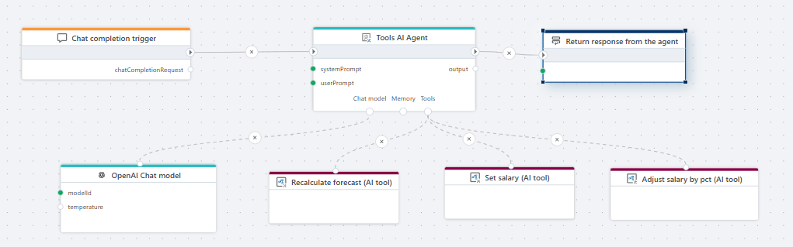

 

### Examples of AI-powered workflows and automations you can build with Flow include:

- Talking to your ERP system to read and write data.
- Analyzing and ingesting data from documents such as PDFs, Word, CSV, Excel, and Parquet files.
- Querying and updating data in databases such as SQL Server and PostgreSQL.
- Analyzing data in Microsoft Fabric, Snowflake, or Databricks and notifying users of anomalies or errors.
- Adjusting parameters (for example, financial assumptions) and applying changes to budgets and forecasts.
- Generating and publishing reports or documents in a wide range for formats.

Flow 1.10 (October 2025 update) adds support for the following nodes, which lets you use Flows as AI agent tools.

### Flow AI tool trigger

The [Flow AI tool trigger](../triggers/ai/flow-ai-tool-trigger.md) enables the Flow to be used as an (AI) tool by AI agents. By adding the [Flow AI tool trigger](../triggers/ai/flow-ai-tool-trigger.md) to a Flow, the Flow can be selected as a tool by the [Flow AI tool](../actions/ai/flow-ai-tool.md) action and used by the [Tools AI agent](../actions/agents/tools-ai-agent.md) to perform a task.

### Flow AI tool

Use the [Flow AI tool](../actions/ai/flow-ai-tool.md) to select a tool for a [Tools AI agent](../actions/agents/tools-ai-agent.md). From the property editor, you can select Flows with a [Flow AI tool trigger](../triggers/ai/flow-ai-tool-trigger.md).

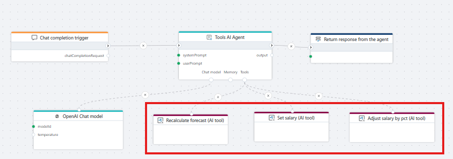

 

## Hypergene Portfolios integration

We now support the [Get report data](../actions/hypergene-portfolios/get-report-data.md) and [Upload data](../actions/hypergene-portfolios/upload-data.md) APIs for Hypergene Portfolios, making it easy to integrate Hypergene Portfolios into any dataflow using Flow.

### Get report data

Use this action to get raw data for a Hypergene Portfolios report in a supported format (JSON, CSV, XML or HTML).  
[Read more here](../actions/hypergene-portfolios/get-report-data.md).

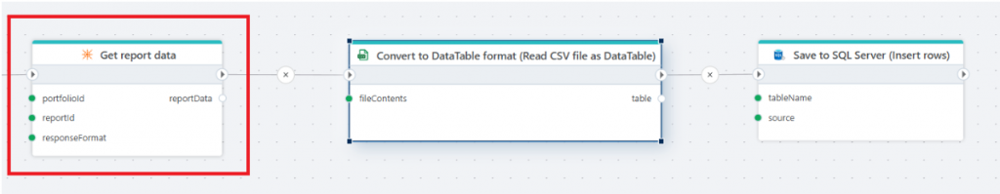

 

### Upload data

Use this action to upload data to Hypergene Portfolios for custom processing.  
[Read more here](../actions/hypergene-portfolios/upload-data.md).

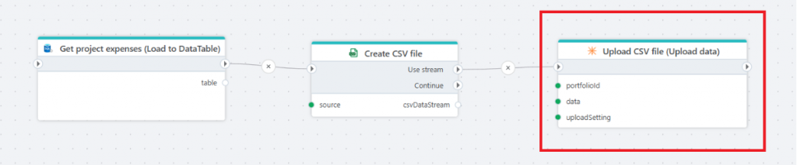

 

## Microsoft Entra ID

To support Microsoft Entra ID related workflows such as user provisioning, user management and application management in Azure, we’ve added initial support for Microsoft Entra ID.

### Invite guest user

Use this action to invite an (external) user into a Microsoft Entra ID tenant.  
[Read more here](../actions/microsoft-entra-id/invite-guest-user.md).

### For each user

Use this action to iterate through (all) users in a Entra ID tenant. A typical use case is synchronizing user information between Entra ID (as the primary IAM system) and 3rd party applications in a business.  
[Read more here](../actions/microsoft-entra-id/for-each-user.md).

### For each app registration and For each client secret info

The For each app registration combined with the For each client secret info action removes a big pain point for SaaS companies (such as ourselves) using Azure; Management and renewal of client secrets before they expire. Using these two new actions, organizations can use Flow to automate monitoring of application secrets, so they can be renewed before expiration to avoid service disruption.  
[Read more here](../actions/microsoft-entra-id/for-each-app-registration.md).

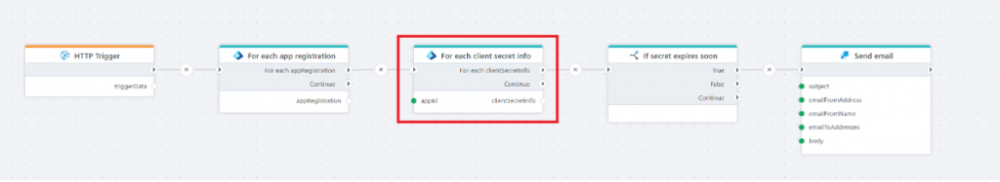

 

## Developer experience – Debugger

The node debugger lets you inspect data flowing through nodes (actions and triggers) after a Flow execution has completed in the Designer. It provides a multi-panel view to explore or export the data sent into and out of each node during execution.

This is a great help during development, as it allows you to examine data and formats while building your Flow — letting you stay within Flow most of the time instead of jumping back and forth between API documentation, database dumps, or similar tools.

You can launch the debugger by hovering over a node or right-clicking it. With the debugger window open, you can inspect all data going in and out of the node during execution. Note that debugging data is only available as long as the Designer remains open. If you close or reload the Designer, you’ll need to re-run the Flow to inspect the data trace again.

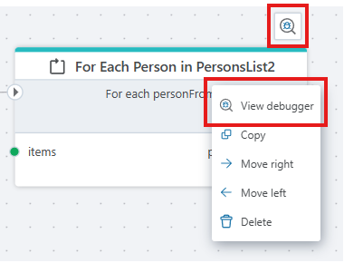

 

The debugger window lets you view data in JSON or tabular format, and supports exporting it to the clipboard or downloading it as a JSON file.

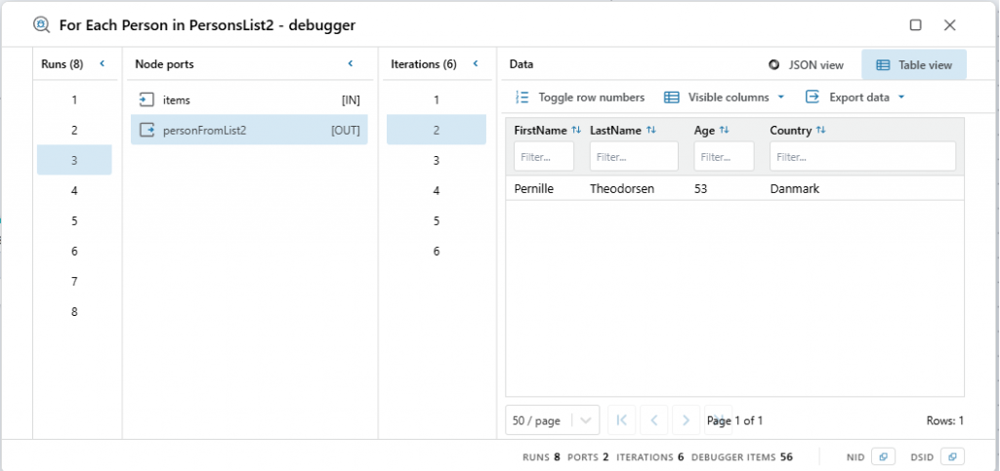

 

>[!NOTE]
> Binary data, such as PDFs, images, or Excel files, cannot be viewed in the debugger window. Instead, you can click a button to open the file in a new browser tab or download it to open manually.
 

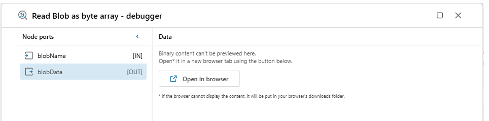

 

## Developer experience – Disabling nodes

You can now disable any action in a Flow by setting the **Disabled** flag in the property panel. This is especially useful when building or debugging Flows, as it allows you to experiment with the Flow’s functionality without actually changing it (for example, by removing, adding, disconnecting, or reconnecting actions).

When you disable an action that returns a value, the Flow will still run, but the node’s output is replaced with an empty value of the same data type. For instance, if an action normally returns a string, it will return an empty string when disabled. If it returns a DataTable, a disabled version will return an empty DataTable with one column and zero rows.

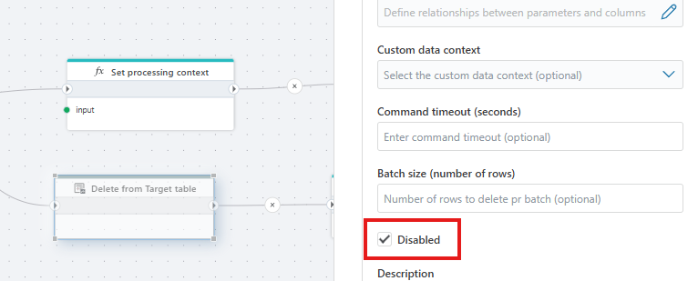

 

## Authentication supported by all HTTP actions

All HTTP actions now has support for authentication. The following authentication options are supported

- Basic authentication (username + password)
- Bearer authentication (header)
- OAuth2 Client Credentials

 

## SQL Server enhancements

### Vectors

Both the [Save vectors](../actions/sql-server/vector-save.md) and [Search vectors](../actions/sql-server/search-vectors.md) actions now has support for setting a timeout.

### Object explorer and query editor in action editors

All SQL Server / Azure SQL actions where users can write queries now has an object explorer that lists all database objects.

Users can also test-run queries directly from the editor, and define test parameters to test parameterized queries.

This feature makes Flow a much better IDE for developing data flows involving SQL Server, as users can now explore and experiment with data directly from the Flow designer instead of having to switch to a different tool.

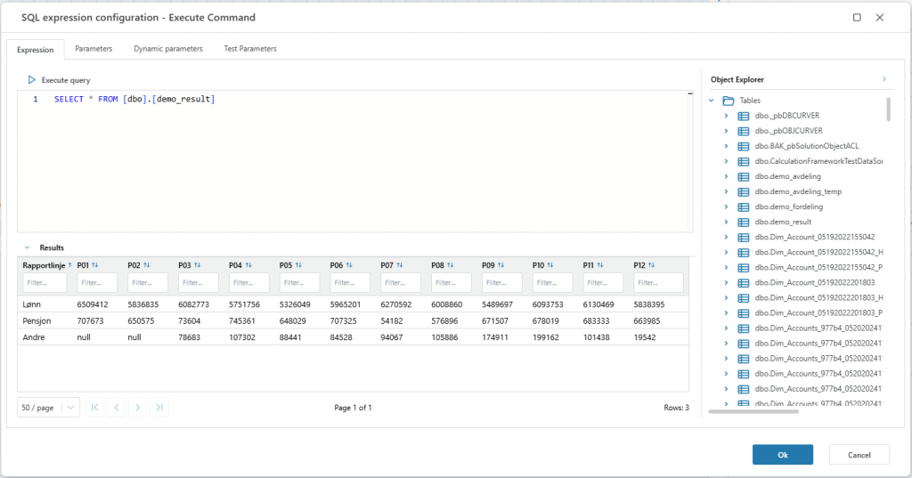

 

## PostgreSQL enhancements

### Vectors

The [Save vectors](../actions/postgresql/vector-save.md) and [Search vectors](../actions/postgresql/vector-search.md) actions now has support for setting a timeout.

### Object explorer in action editors

All PostgreSQL actions where users can write queries now has an object explorer that lists all database objects. This enhances the developer experience when building data flows involving PostgreSQL.

 

## Snowflake enhancements

### Object explorer in action editors

All Snowflake actions where users can write queries now has an object explorer that lists all database objects. This enhances the developer experience when building data flows involving Snowflake.

### Support for programmatic access token

The Snowflake connection now supports authentication using Programmatic Access Tokens. The legacy username / password authentication method is being deprecated by Snowflake, and we recommend all customers to switch to a different authentication method.

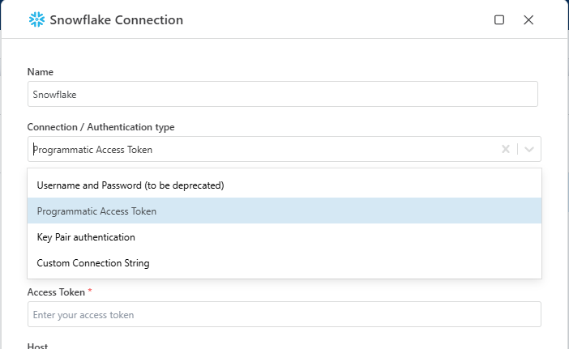

 

## CSV enhancements

### CSV import: Support for specifying escape character

We added support for selecting which escape character to use when reading CSV files. The default value is ” (double quote), but you can now also specify backslash ( \ ) as the escape character.

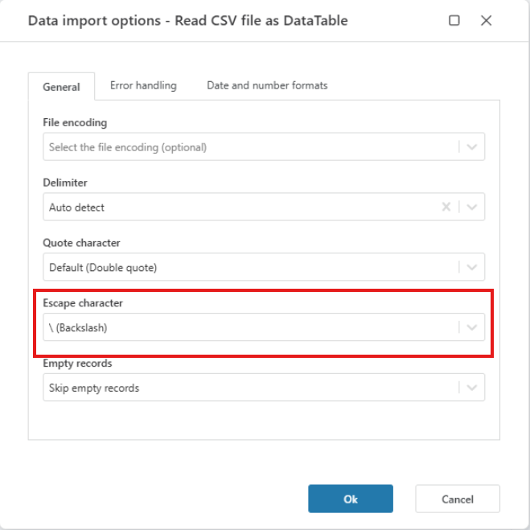

 

## Calculation Flow DB Output and Output now supports (in-memory) .NET DataTable as input and output

This feature enables passing data between calculation flows in-memory instead of reading and writing to the database as an intermediary. This improves overall performance for all financial calculations in Planner and Consolidation. It also enables passing data in to a calculation flow from an API, and also returning tabular data directly from a Flow to an API client. Performance is also improved for these scenarios, because no database reads and writes are required.
