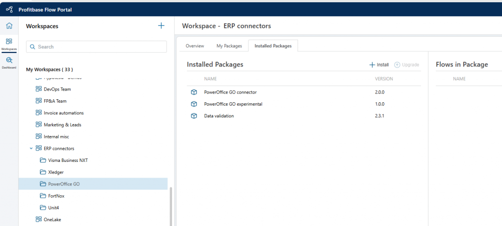
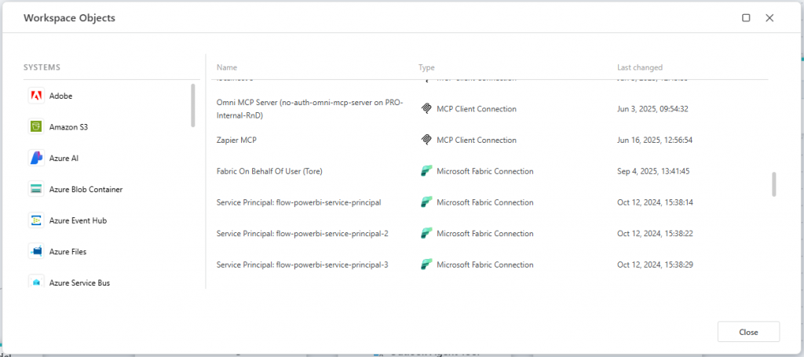
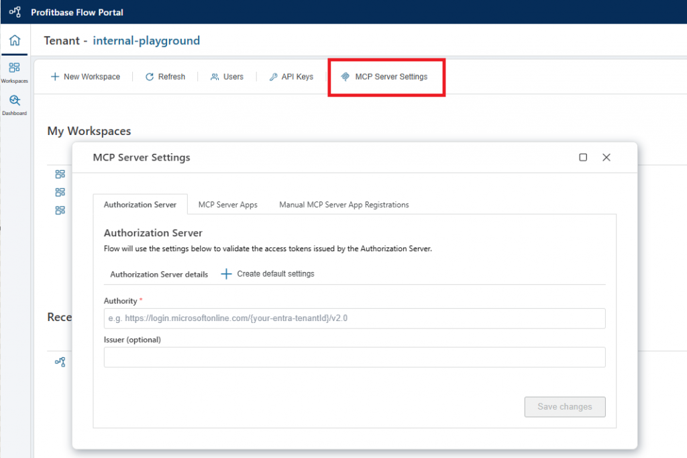

# September 2025 update

The September 2025 update of Flow is mainly a service release, focused on internal improvements to prepare for upcoming releases centered on debugging and developer experience. Still, we’ve added a few new features, including package installation to folders and OAuth support for Flow MCP servers.

 

## Install packages to folders

You can now install Packages into folders, making it easier to manage and organize Packages from other sources. To do this, select a folder in the Workspace Explorer, open the **Installed Packages** tab, and click **Install**.

 

## Updated Workspace Objects UI

We updated the Workspace Objects UI to make it quicker to find and edit connections when there are many. The UI now looks more like the toolbox, making the interface more uniform and familiar.

 

## Flow MCP servers now support OAuth

Flow MCP servers now support OAuth authentication, the official protocol recommended in the MCP specification. This allows MCP clients to authenticate and connect to Flow MCP servers using a standard protocol, utilizing dynamic client registration if the identity provider supports it.

By default, Microsoft Entra ID is used as the authorization server, but you can also configure your own, such as Keycloak, Auth0, or Okta.

Read more about [MCP Server Settings here](../tenants/mcp-server-settings.md).

 

## Markdown conversion enhancements

We’ve released an improved version of our document conversion service for turning various file formats into Markdown. It now scales dynamically to handle heavier loads and processes conversions faster.

 

## Bug fixes and minor enhancements

- Fixed issue related to pgVector for PostgreSQL vector db operations
- The [Run Flow](../actions/built-in/run-flow.md) action (for nested execution) now supports conversion of custom data types returned from the called Flow
- Opening a Flow in a Workspace without permissions now correctly shows an **unauthorized** message rather than a generic error
- You can now use variables to specify which field to filter on when doing vector search
- Updated supported formats list for the Adobe nodes that convert from non-PDF to PDF files
- Cached InVision objects are now immediately evicted from cache when the [Remove InVision object from cache](../actions/built-in/remove-invision-object-from-cache.md) action is used.
