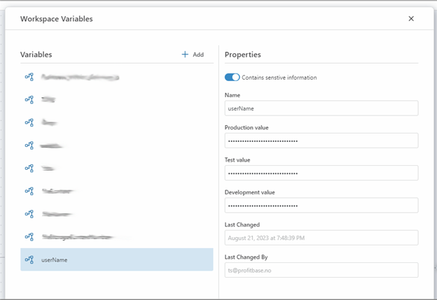

#### Environments

Profitbase Flow defines three environments: 

- Development 
- Test
- Production. 

> [!NOTE]
> Access to different environments may vary depending on your subscription plan. Typically, the Test environment is not accessible with free or lower-cost subscriptions.

While developing a Flow, you are working in one environment which usually is the `Development` environment. Once your Flow reaches a stage where it's prepared for testing or deployment to production, you should publish it to either the `Test` or `Production` environment. This allows your users or external APIs to access a stable version of the Flow, while you can continue development of subsequent versions or features.

Environments and [Workspace Variables](workspaces/workspace-variables.md) are closely related. Each Workspace variable can hold a distinct value pr Environment.  This functionality enables the deployment of a Flow to various environments, allowing it to access different resources, such as databases or data sets, based on which Environment it is deployed to, without the need to make changes to the configuration of the Flow.

 

