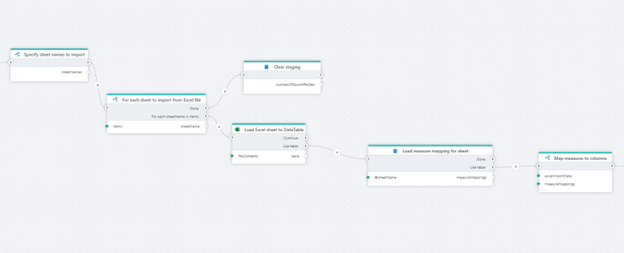
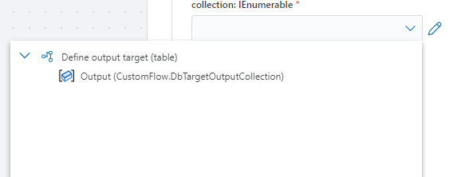

# Actions and Triggers

The business logic of a Flow is defined by combining triggers and actions into a "program" that runs from start to finish. To define the execution path of a Flow, connect the **Execution In** and **Execution Out** ports of actions in the desired order. Data and conditions may determine which path the Flow executes to complete its task. 

 

There are a few simple rules that apply to how actions and triggers can be used in a Flow:

-	A Flow can have zero or one trigger. In cases where you want to trigger a Flow based on events from multiple systems, use the [Multi-Trigger](../triggers/multi-trigger.md).  
-	A Flow can have any number of actions.
-	A Flow cannot have multiple entry points. An entry point is defined as an action or trigger with no inbound connections. If you add multiple entry points, Flow will execute the path with the longest chain of actions. All other actions will be ignored. 
-	A trigger does not have parameters, but it can return an output. (All triggers except the Schedule trigger have some type of output)
-	Actions can have parameters and return zero or one result. 
-	Some actions, such as the If-Else block and Foreach loop have multiple execution sub paths.

## Inputs and outputs

Actions can have parameters (inputs) and return a value (output). An action and a trigger can only have a single output, but an output can be a collection of items, a complex business object or a simple scalar value like a number.

In Flow, variables, inputs, and outputs have specific data types and only compatible data types can be used together.  For example, you cannot pass a `string` output or variable to a `numeric` input. 

When you select a parameter and open the selector, a list of all variables with `compatible data types` will be listed. Choose the appropriate value to use it as input to the parameter.

 

**No compatible data found**

When using the Flow designer to configure parameters of an Action, you will only be able to select variables having compatible data types as inputs. If the variable selector display no items to select, it means that there is no compatible data available to use as input to the action.
