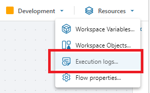

# Debugging and logging

By default, Profitbase Flow only logs the start and end of executions. If you want to log anything else, you can use the [Log](../actions/built-in/log.md) action. You can also using a [Function](../actions/built-in/function.md) action and call the `Context.Log` APIs if you need fine-grained control.  


<br/>

```csharp
public async Task Foo()
{
    await this.Context.Log.Error(…) // Write an error to the log. It will also set the final status of the run as failed.  
    await this.Context.Log.Warning(…) // Write a warning to the log.  
    await this.Context.Log.Information(…) // Write an information entry to the log.  
    await this.Context.Log.Debug(…) // Write an entry to the debug log.  
}


```

When you run a Flow from the Designer, any log and debug information will appear in the bottom panel.  


<br/>


To view logs from previous runs, open the [Execution logs](execution-logs.md) window from the `Resources` menu in the application bar.

<br/>



<br/>

## Logging in extension libraries
When developing extension libraries to Flow (such as the Financials library), being able to write messages to the Flow log from within the library is often useful. To do this, call the `Context.Log.AsILogger()` API to get an [ILogger](https://learn.microsoft.com/en-us/dotnet/api/microsoft.extensions.logging.ilogger) instance. You typically do this in a [Function](../actions/built-in/function.md) action, but you can also do it when declaring a variable. The messages you write through the ILogger will be displayed in the Flow log. 


#### Example
The example below shows how to get an ILogger instance in a [Function](../actions/built-in/function.md), and pass it to a custom library, where it can be used for writing log messages to the Flow log. 

```csharp
var myLibrary = new MyCalculationLibrary(this.Context.Log.AsILogger());
myLibrary.Foo();
```