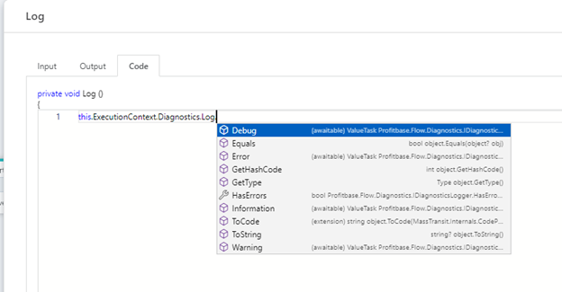
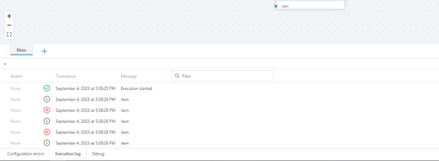
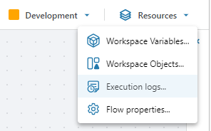

#### Debugging and logging

By default, Profitbase Flow only logs the start and end of executions. If you want to log anything else, you need to do this manually using a Function action and one of the **ExecutionContext.Diagnostics.Log** APIs.

 

ExecutionContext.Diagnostics.Log.**Error(…)** will write an error to the log. It will also set the final status of the run as failed.  
ExecutionContext.Diagnostics.Log.**Warning(…)** write a warning to the log.  
ExecutionContext.Diagnostics.Log.**Information(…)** writes an information entry to the log.  
ExecutionContext.Diagnostics.Log.**Debug(…)** writes an entry to the debug log.  

When you run a Flow from the Designer, any log and debug information will appear in the bottom panel.  

 

To view logs from previous runs, open the Execution logs window from the Resources menu in the application menu.

 

