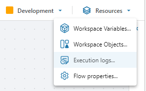

#### Debugging and logging

By default, Profitbase Flow only logs the start and end of executions. If you want to log anything else, you need to do this manually using a [Function](../actions/built-in/function.md) action and one of the **Context.Diagnostics.Log** APIs.

<br/>

```csharp
public void Foo()
{
    Context.Diagnostics.Log.Error(…) // Write an error to the log. It will also set the final status of the run as failed.  
    Context.Diagnostics.Log.Warning(…) // Write a warning to the log.  
    Context.Diagnostics.Log.Information(…) // Write an information entry to the log.  
    Context.Diagnostics.Log.Debug(…) // Write an entry to the debug log.  
}


```

When you run a Flow from the Designer, any log and debug information will appear in the bottom panel.  


<br/>


To view logs from previous runs, open the Execution logs window from the Resources menu in the application menu.

<br/>

