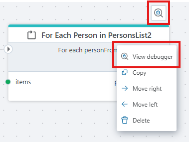
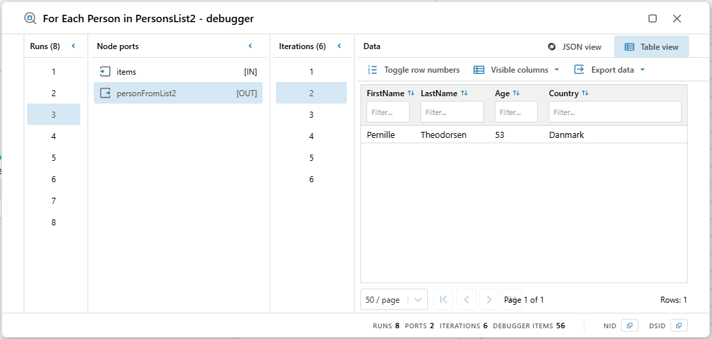
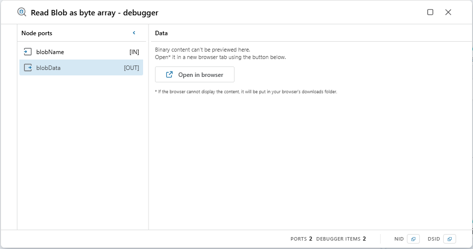

# Node debugger

The node debugger lets you inspect data flowing through an individual node after a flow execution has completed in the designer. It provides a multi-panel view to explore or export the data present on a nodes input and output ports during the flow execution.

>[!NOTE]
>Data cannot be displayed in the debugger until the flow has been executed at least once (press the play button) from the designer interface. The debugger can remain open during flow execution and will display the relevant data as soon as execution completes.

 

## Opening the dialog

You open the debugger dialog by either clicking the appearing button above the node when your mouse pointer hovers over the node or by right-clicking the node and choosing 'View debugger'.

<em>Figure: The debugger dialog can be opened via the hover action button or by right-clicking the node and selecting “View debugger”.</em>

 

<em>Figure: The debugger dialog showing 8 runs, each producing 6 loop iterations for the "for each Person in PersonsList2" node during the execution of the flow.</em>

 

Each dialog instance is associated with a session ID (DSID) and a node ID (NID). To copy these IDs, click on NID or DSID in the footer. If you attempt to open the same dialog twice, the existing window will be brought to the front. The window is resizable and can remain open while the flow executes. The data is reloaded after execution completes.

 

## Concept glossary

| Term | Meaning |
|------|--------|
| Run | A single execution instance of the node. |
| Port | A specific input or output port on the node. |
| Iteration | A sequential occurrence of a port trace within a run (appears when a port receives values multiple times, e.g. in loops). |

 

### Runs panel
Shows all distinct run numbers (the number of times a node was called during the flow execution) in ascending order. Visible only when there is more than one run. Selecting a run filters the available debugger items for downstream panels.
 
 

### Ports panel
Lists the ports encountered in the trace data for the node.  
Port entries display the port’s name and direction ( [IN] to the node or [OUT] from the node).  
Selecting a port filters iterations and narrows data to that (run + port) combination.
 
 

### Iterations panel
Shows iteration numbers within the selected run/port. This panel is only visible when the node itself iterates and produces its output value multiple times during the execution. This is typically the case for nodes that loops.
 
 

### Data panel
Displays the data for the selected run, port, and iteration.

**Table view**
- Auto-generated columns from the first object's keys.
- Column filtering (multiple filters combine via union logic).
- Column sorting (click arrow icons).
- Line number toggle.
- Pagination controls.
- Column visibility toggling.
- Copy to clipboard (clicking a cell copies its raw value).
- Export actions (JSON, CSV, tab-delimited).

**JSON view**
- Collapsible, pretty-formatted JSON tree.
- Expand/collapse nodes to focus on relevant sections.
- Inline syntax coloring for improved readability.
- Export actions (JSON, CSV, tab-delimited).

**Binary data handling**
- If the data is binary use “Open in browser” to attempt viewing the content inline in the browser. The data will also be put in a file and downloaded to the browsers download folder.
 

<em>Figure: Binary data will be attempted opened inline in the browser for some supported types. The data will always be downloaded to your download folder if the "open in browser" button is pressed.</em>

 
 

## Supported media types & inline preview
Data described by the following media types will be opened inline in the browser when possible:
- Text (`text/plain`, `application/json`, `text/*`)
- Images (`image/png`, `image/jpeg`, `image/gif`, `image/webp`, etc.)
- Simple structured formats (CSV).

Unsupported or opaque types (binary blobs) are always downloaded.