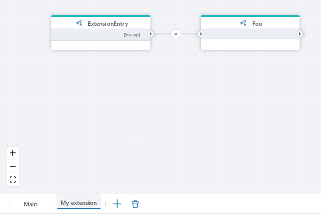
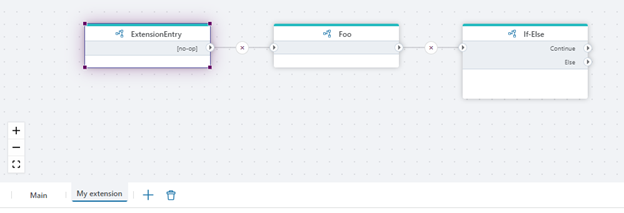

#### Modularization and extensions

You can use `Extension flowchart` to break large Flows up into smaller units, or to enable extending a Flow with custom logic without modifying the Main flowchart.

 

To use this capability, you need to do the following:

-	Add a [Hook action](../actions/built-in/flow-hook.md) to the Main flowchart where you want Extension flowchart to plug in their business logic.
-	Create an Extension flowchart and add a [Hook Handler](../actions/built-in/flow-hook-handler.md) action. In the Hook Handler action, select the Hook in the Main flowchart that you want to hook into, and then build the rest of the Extension as a continuation of the Hook Handler.  

 

