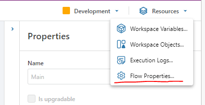
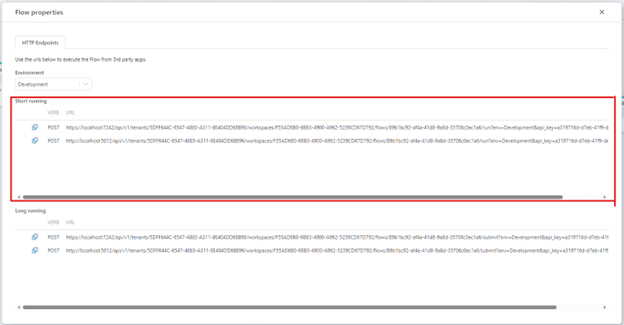
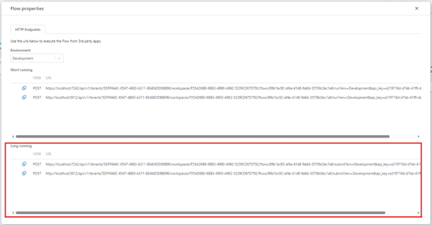

#### Running Flows from 3rd party applications

To run a Flow from a 3rd party application, you must use one of the API endpoints of the Flow. You can find the API endpoints of a Flow in the `Resources -> Flow Properties` window, or you can add a [HTTP trigger](../../triggers/http-trigger.md) to the Flow.

> [!NOTE]
> To run a Flow from a 3rd party application or client, you must configure at least one API key at the tenant level.

 

To execute a **short-running** Flow, use the Short-running HTTP API endpoint. The API will return when the Flow has completed execution. If the Flow is configured to return a value or a file, you can read the result from the HTTP response body. For non-binary data, data is returned as JSON. The shape is defined by the shape and data type of the value that the Flow is configured to return. 
 
 

To execute a **long-running** Flow, use the Long-running HTTP API endpoint. The API will return a job id that you must use to start polling for completion. Once the Flow has completed, you can fetch the result that the Flow might have produced by either calling another (short-running) Flow, or use a custom API (for example a call directly to a database).

 

