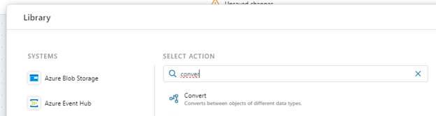

#### Running Flows within Flows

To run a Flow within another Flow, use the **Run Flow action**. 
 
 

##### Input

If the Flow you want to run can handle input data, you can specify an input argument to pass to the Flow. All Flows technically accepts a single argument, but it's up to the implementer to decide whether to use that data or not. It is also up to the implementer to decide the format of the input data. It can be anything from a simple numeric value to a complex business object.  To know the type and format of the data you can pass in, you need to open the Flow you want to run and examine its configuration. 

##### Returned value

If the Flow you want to run returns data, you can use the data returned as input to actions later in the Flow. Note, however, that the data returned is typed as System.Object, so you may need to convert it to a type known by the calling Flow before you can use as input to other actions. 

To convert a value to a different type, you must use the Convert action. This action can convert between objects as long as the source and target types are convertible.
 
 

