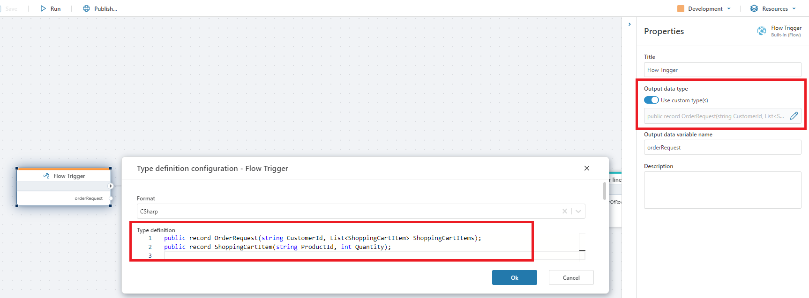

# Running Flows within Flows

To run a Flow within another Flow, use the [Run Flow](../../actions/built-in/run-flow.md) action. 
 
<br/>


## Input

If the Flow you want to run supports parameterization, you can specify an argument to pass to the Flow. All Flows technically accepts a single argument, but it's up to the implementer to decide whether to use that data or not. It is also up to the implementer to decide the format of the input data. It can be anything from a simple numeric value to a complex business object. To know the type and format of the data you can pass in, you need to open the Flow you want to run and examine its configuration. If the Flow is implemented following best practices, it should have a [Flow trigger](../../triggers/flow-trigger.md) which optionally defines the parameter type definition.

## Returns

If the Flow you want to run returns data, you can use the data returned as input to actions later in the Flow. Note, however, that the data returned is typed as [System.Object](https://learn.microsoft.com/en-us/dotnet/api/system.object), so you almost always have to convert it to a type known by the calling Flow before you can use as input to other actions. 

To convert the returned value to a format that can be used by actions in the calling Flow, specify the `Output data type` property of the [Run Flow](../../actions/built-in/run-flow.md) action in the `Properties` panel. 
 

### Example

This example demonstrates how to run a Flow within another Flow. We will call them `Order processor` and `Create order`, respectively.
`Order processor` will pass a list of shopping cart items to `Create order`, which in turn will return an Order object back to `Order processor`.

#### Outline

1) `Order processor` calls `Create order` using the [Run Flow action](../../actions/built-in/run-flow.md), and passes in an order request coming from an HTTP request via an [HTTP Trigger](../../triggers/http-trigger.md).  
2) `Create order` has a [Flow trigger](../../triggers/flow-trigger.md) which converts the input from `Order processor` to a list of shopping cart items.
3) `Create order` processes the items and returns an Order object to `Order processor` using the [Return action](../../actions/built-in/return.md)
4) `Order processor` converts the Order object returned from `Create order` to its own object so it can be used by other actions in the Flow.


#### Step-by-step

##### Configure the Create order Flow

1) Create a Flow named `Create order`.

2) In `Create order`, create a [Flow trigger](../../triggers/flow-trigger.md) to define the entry point of the Flow, and the format of the data that `Create order` accepts as input from `Order processor`.

3) Select the Flow trigger, toggle `Output data type` to `Use custom type(s)`, and open the data type editor in the `Properties` panel. Define the following data format:  


4) Define the business logic to process the shopping cart items. As this is beyond the scope of this example, we will not go into details on these steps. A quick-and-dirty implementation would be to simply insert data to a database. The image below shows a series of steps to create an order id, create order lines and save them to a SQL Server database.
<br/>


<br/>

4) The final steps of `Create order` is to return the Order object so it can be used by the caller. 
To do this, you can either add a [Define Type](../../actions/built-in/define-type.md) action or define the the Order object using [custom code](../defining-custom-code.md). We've opted for custom code in this example. 

<br/>


<br/>

Next, use a [Function](../../actions/built-in/function.md) action to create an instance of Order and use the [Return](../../actions/built-in/return.md) action to return Order from `Create order`.


<br/>

##### Configure the Order processor Flow

`Order processor` will call `Create order` by passing in an order request and get back the Order.

1) Create a [HTTP Trigger](../../triggers/http-trigger.md) and define the input. This is the order request that we will pass directly to `Create order`. 
Select the HTTP Trigger and define the input from the `Data definition` property in the `Property panel`. It should look exactly like the data definition we created in `Step 3` of the `Create order` Flow above.

<br/>


2) Add a [Run Flow action](../../actions/built-in/run-flow.md). In the `Properties panel`, select `Create order` as the Flow to run, and select the data variable from the HTTP Trigger as input. It should look similar to this:
<br/>


3) With the Run Flow action still selected, use the `Output data type` property in the `Properties panel` to define the format of the Order object returned from `Create order`. By defining the format of the object, you tell Flow how to handle the data returned from the other Flow and convert it into something that can be used on the receivng end.  

From `Step 4 ` of the `Create order` Flow above, we remember that the format of the object was

```csharp
public record Order(string OrderId)
```

##### Summary

To summarize how to run a Flow in another Flow, you need to use the [Run Flow](../../actions/built-in/run-flow.md) action.
If you want to exchange data between the Flows using custom business objects, you need to define the formats of the data you want to exchange on both sides. 

> [!NOTE]
> Note that you only need to define data formats if you want to pass custom business objects between the Flows. If you only want to pass data back and forth  using standard .NET types such as strings, numbers, dates etc, you can simply select the standard type to use in the `Output data type` property. 

