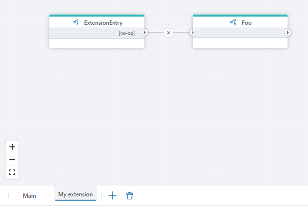

# Schemas

Each Flow has at least one flowchart, which is called "Main". This is where you define the main sequence of actions that drive the business logic.

## Main flowchart

The Main flowchart can only contain a single entry point, which can be either an [action or a trigger](actions-and-triggers.md). During development, you are technically allowed to have multiple entry points in the Main flowchart, but only the path with the most number of actions will be executed.

## Extension flowchart

In addition to Main, you can add multiple sub-flows called `Extension flowcharts`. You can use `Extension flowcharts` to break large Flows up into smaller units, or to enable extension of a Flow with custom logic without modifying the Main flowchart using the [Hook](../actions/built-in/flow-hook.md), [Hook handler](../actions/built-in/flow-hook-handler.md) and / or [Extension Entry](../actions/built-in/extension-entry.md) actions.

 

## Properties

| Name            | Description                   |
|-----------------|-------------------------------|
| Name            | This is the name of the schema as displayed in the footer tab. The name is simply a way of labelling a schema, so you can safely rename flowcharts as you see fit without breaking anything. You cannot rename the Main flowchart.|
| Development execution type | This property is only available on the Main flowchart. It specifies whether the Flow should be executed as a [short-running or long-running Flow](../flows/long-vs-short-running-flows.md) when you press the "Run" button in the Designer. For more information about short-running vs long-running Flows go to the dedicated subject [here](../flows/long-vs-short-running-flows.md). |
| Is upgradable     | This feature is used only when you need to extend a Flow which is part of a Profitbase Product package, such as Profitbase Planner. If you mark an Extension flowchart as upgradable, it will be removed or overwritten during a Package upgrade. If you leave "Is upgradable" as false, the extension flowchart will remain untouched by the Package upgraded. |
| Custom code    | Custom code is an advanced feature which enables you to write custom C# code that can be used in Function actions in a Flow. The custom code you can write ranges from custom classes, to just helper functions that you want to reuse throughout the Flow. Note that the custom code is not available to other Flows in the Workspace. |
| Description     | Use this property to add any description |
