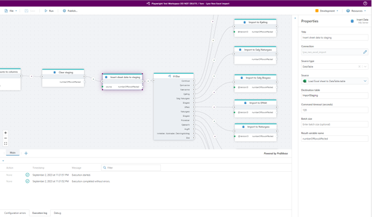
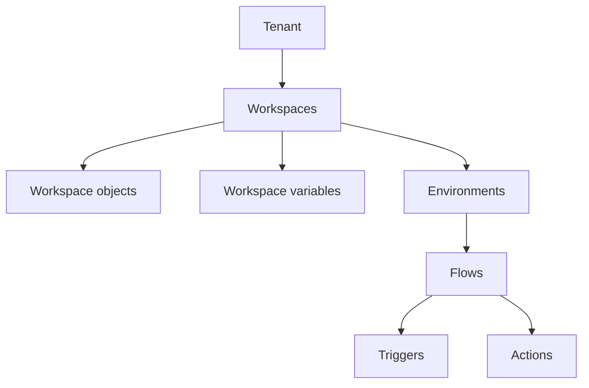

# Key Concepts

Profitbase Flow is an automation platform that enables users to create sequences of operations by combining triggers and actions, allowing for the expression of various business processes, rules, and data integrations.  
Development takes place via a web-based drag-and-drop interface, with execution options available in both cloud and on-premises environments.

 

## Tenants

A tenant serves as the foundation for a client account, encompassing a subscription plan, user management, and associated billing information. Based on the  the subscription plan, the tenant has access to defined set of resources like CPU, networking, and memory. While typically a company corresponds to a single tenant, it's entirely feasible for a company to create multiple tenants, each of which is billed separately.

## Workspaces

A Workspace is a logical container of Flows and artifacts. Workspace artifacts include Workspace Variables and Workspace Objects, which are resources that can be shared by all Flows in the Workspace. A Workspace also defines which users have access to the Workspace.

### Workspace Objects

Workspace Objects are reusable objects that consist of multiple values, for example a SQL Server connection having a server name, database name, username, and password. Instead of defining a different connection for every SQL Server action in a Flow, you can reuse an existing connection object and manage its settings once.

### Workspace Variables

Workspace Variables are simple values that can be shared by all Flows in a Workspace, for example, a connection strings, usernames, database names or numeric values. Workspace Variables also can be used in Workspace Objects.

Environments and Workspace Variables are closely related. Each Workspace variable can hold one distinct value pr environment. For example, you may define a _ConnectionString_ variable that points to different databases for Development and Production. This functionality enables you to deploy a Flow to different environments without having to make manual changes to the configuration of the Flow when it's deployed to the target environment.

### Environments

Profitbase Flow defines three environments:

- Development
- Test
- Production.

While developing a Flow, you are working in one environment. To follow best practices, this should be the Development environment. Once your Flow reaches a stage where it's prepared for testing or deployment to production, you should publish it to either the Test or Production environment. This allows your users or external APIs to access a stable version of the Flow, while you can continue development of subsequent versions or features.

Environments and Workspace Variables are closely related. Each Workspace variable can hold one distinct value pr environment. For example, you may define a _ConnectionString_ variable that points to different databases for Development and Production. This functionality enables you to deploy a Flow to different environments without having to make manual changes to the configuration of the Flow when it's deployed to the target environment.

Access to different environments may vary depending on your subscription plan. Typically, the Test environment is not accessible with free or lower-cost subscriptions.

## Flows

Flows is where you define all business logic by combining triggers and actions into a sequence of operations.

A Flow can be run manually from the Designer, from a 3rd party app via an HTTP endpoint, as a response to an event in an external system or scheduled on a regular basis.

### Triggers

Use triggers to run Flows as response to events from external systems, such as incoming mail, new files uploaded to an Azure Storage Container, or a message added to an Azure Service Bus queue. A Flow can only contain a single trigger node, and the trigger node must be the first node in the Flow. If you need a Flow to react to events from multiple source systems, you can use the MultiTrigger.  

### Actions

Actions define the business logic of a Flow. Actions are combined as a sequence of operations, where each action can perform a single task. Most actions can take data as input and/or return data as output. Data returned from the action can be used as input to other actions later in the Flow, if data formats are compatible.  

