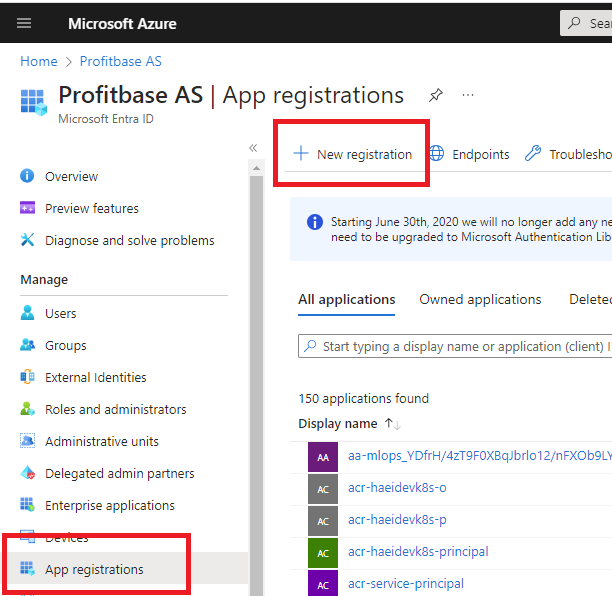
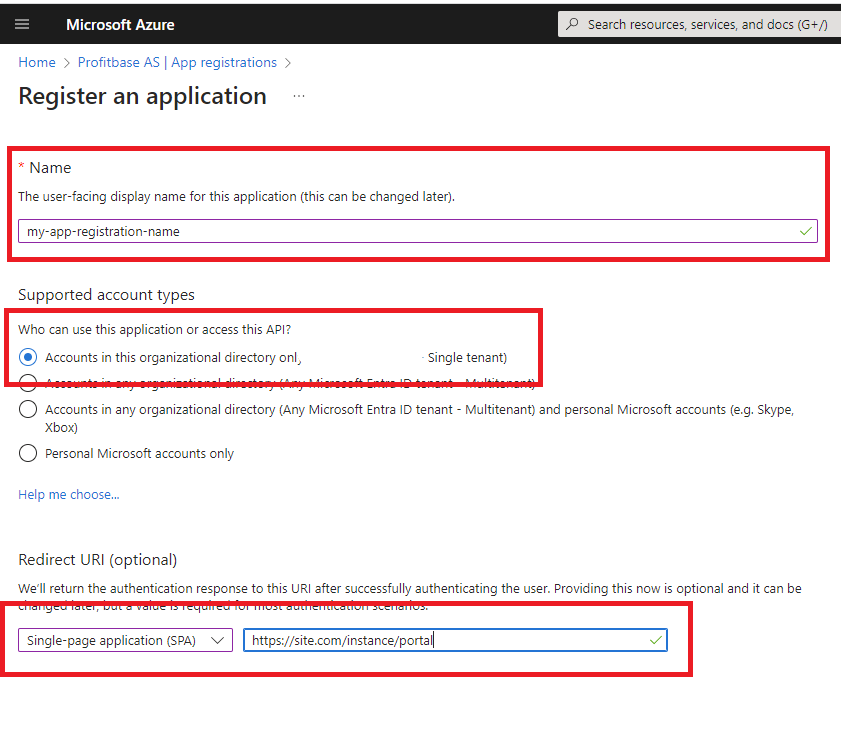
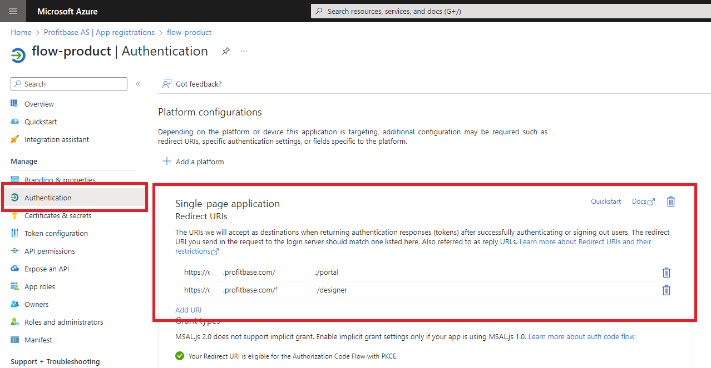
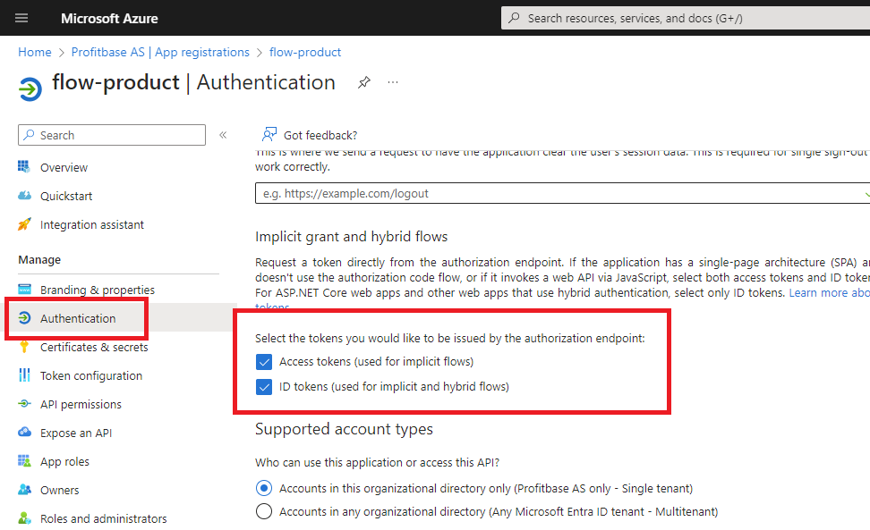
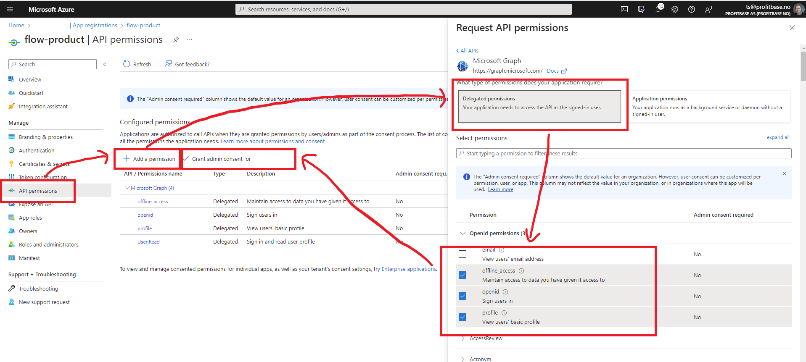
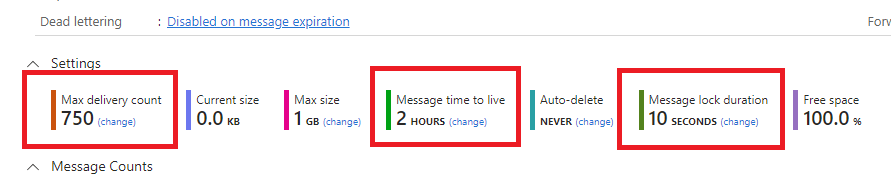

# Step-by-step installation (On-premises)

#### Step 1: Download and install .NET 7 Hosing Bundle	

Download and install .NET 7 Hosing Bundle from [here](https://dotnet.microsoft.com/en-us/download/dotnet/7.0). 
  
 

#### Step 2: Create an Entra ID Application registration

##### 1) Create the app registration

In the Azure portal, go to **Microsoft Entra ID** -> **App registrations** and choose **New registration**

1) Enter the name of the app registration. This is the name of the application registration in the Azure portal. It can be whatever you like, but you should choose a meaningful name.  
2) Under Supported account types, choose **Accounts in this organizational directory only ([Your company - Single tenant])**  
3) Under Redirect URI, choose **Single-page application (SPA)**.  

##### 2) Configure authentication  

Under **Authentication**, add the following Redirect URIs:

*	https://site.com[/instance]**/designer**
*	https://site.com[/instance]**/designer/**
*	https://site.com[/instance]**/portal**
*	https://site.com[/instance]**/portal/**

 
 

Under **Authentication**, enable:

*	Access token

*	Id token
 
 

##### 3) Configure API permissions  

Under **API Permissions**, enable the following **Delegated permissions** for **Microsoft Graph**:

*	User.Read

*	openid

*	profile

*	offline_access
 
 

#### Step 3: Create Azure Service Bus queues and topics

1) In the Azure portal, choose an existing Service Bus Namespace or create a new one.
2) Create queue **profitbase-flow-[instance name]-execution-queue**
2) Create topic **profitbase-flow-[instance name]-change-notification-topic**
3) Create topic **profitbase-flow-[instance name]-execution-broadcast-topic**

> [!NOTE]
> You can name the queue and topics however you want. The names above are just a naming convention.

Configure each queue and topic as follows:  
Max delivery count: **750**  
Message time to live: **2 hours**  
Message lock duration: **10 seconds**  

#### Step 4: Create an Azure Blob container

1) In the Azure portal, choose a Storage account or create a new one.
2) Add a new container named **profitbase-flow-[instance name]**. Permissions must include **Read**, **Add**, **Create**, **Write**, **Delete** and **List**.
3) Create a SAS Uri

#### Step 5: Install the software using Profitbase Installation Manager

1) Install Profitbase Installation Manager from [here](https://download.profitbase.com/installer). Choose version 5.3.0.8 or higher.