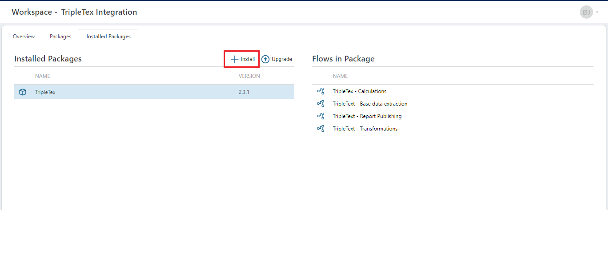

# What is a Flow Package ?
A Flow Package serves as a container for a collection of Flows, allowing users to bundle Flows with their dependent resources ([Workspace Objects](../workspaces/workspace-objects.md) and [Workspace Variables](../workspaces/workspace-variables.md)). The package can be exported to a file and imported into another Workspace. 

 

## Create 
To create a Flow Package press the Create button under the Package tab in a Workspace and fill out the properties in the appearing dialog. 

 

### Properties

| Name                     | Type     | Description                 |
| ------------------------ | -------- | --------------------------- |
| Name                     | Required | The name of the package. This will be displayed in the lists where the package is referenced. When an package export is made, this name together with the version will be used to give the export file its name. |
| Version                  | Required | The version of the package, which must follow the x.y.z format, where x, y, and z are digits between 0 and 999. The z (patch version) is optional.|
| Author                   | Required | The name of the creator of the package.           |
| Documentation(URL)       | Optional | A URL to the package documentation. |
| Package Icon             | Optional | A custom package icon. |
| Preferred Environment    | Required | The Preferred Environment is the environment from which a Flow is selected during the package export process. If the Flow is not available in that environment, the export will default to the Development environment.|
| Description              | Optional | Additional notes or comments about the Package.|

 

## Edit 

To modify the properties of an existing Package, use the Edit button for the selected Package. To update the collection of Flows within the package, use the Edit button in the 'Flows in Package' section. Remember to update the version number if you change the content of the package before exporting it.

 

## Install 
Installing a Package is done under the "Installed Packages" tab in a Workspace. Press the Install button and select a file containing the Package export.
A package cannot be installed in the same Workspace where it was created.

If the selected Package was created with a older Flow version, it will automatically be upgraded to the current Flow instance version.

 

## Upgrade 

Upgrading a Package is done by selecting the upgrade functionality in the Installed Packages functionality and then choosing a file that contains an export of the selected Flow Package. The content of the upgrade file must contain a version property with a newer/higher version then the installed package.

 

## Delete 

To delete an installed package, access the delete functionality on the selected Package in the Installed Packages tab. To delete a package definition, access the delete functionality on the selected package definition in the Packages tab.