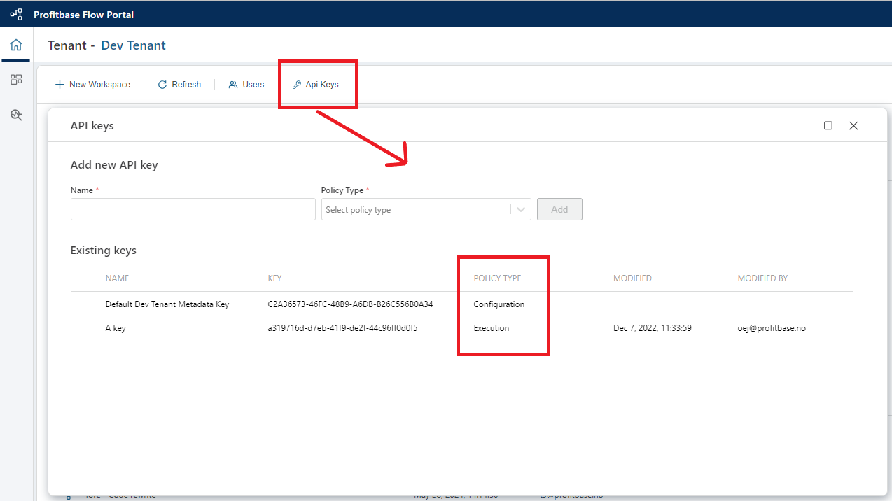

# API Keys

API keys are used to authenticate and authorize API calls to Profitbase Flow. It is required in order to [execute Flows from 3rd party applications](../flows/running-flows/from-third-party-app.md) or make metadata API calls. API keys are only valid for the tenant in which they are defined.

### Policy types

The policy type determines the scope of the API key.

| Policy         | Permission                         |
|----------------|------------------------------------|
| Execute        | Grants permissions to execute a Flow via its HTTP endpoint. |
| Configuration  | Grants permissions to make metadata API calls to Flow. |
| MCP            | Grants permissions to call a Flow as an MCP tool. |
| A2A            | Grants permissions to call a Flow as a remote agent using the A2A protocol. |

When making an API call to Flow, the API key must be included in [the query string or in the request header](../api-reference/execute-flow/run.md). 

 