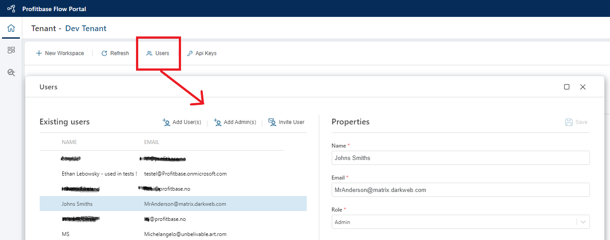

# Users

Only authorized users can can log in to Profitbase Flow and access tenants. In order to be authorized, the user must be registered and assigned the Admin or Member `role`.  

Both admin and member users are managed in the Users screen. If you need to change any properties of a user, such as the email or role (Admin / Member), you can do this at any time after the user has been created. The changes will take effect the next time the user loads the app.  

### Admin users

An Admin user has access to all features and Workspaces in a Tenant, and can assign other users to the admin role.  

### Member users

Member users can only access the Workspace(s) they have been granted access to by administrators.  
To grant a Member user permissions to a Workspace, go the the Workspace and [grant permissions to the user from access control screen](../workspaces/workspace-access-control.md).  
 
