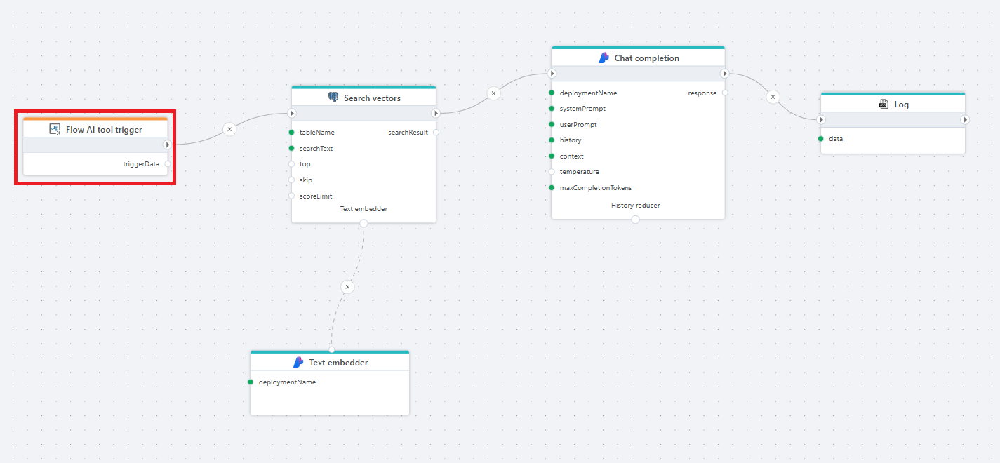

# Flow AI tool trigger

Enables a Flow to act as an **AI tool**, allowing AI agents (for example, OpenAI agents or MCP agents) to call the Flow as a tool during their reasoning process.

This trigger serves as the entry point for Flows that should behave like callable functions inside an AI system — receiving arguments from the AI agent, executing business logic or integrations, and returning structured output back to the agent.

  

**Example**   
This Flow is exposed as an AI tool using the Flow AI tool trigger.
It allows an AI agent to call the Flow in order to generate an answer based on vector search results. 
The Flow receives input arguments from the AI agent, retrieves relevant context from a vector store, and returns a single generated response. 
 

## Properties

| Name | Type | Description |
|------|------|-------------|
| Title | Optional | A descriptive label for the trigger. |
| Tool name | Required | The name of the tool as exposed to the AI agent. Must match the tool definition used by the agent. |
| Parameters | Optional | Defines the input schema for the tool. The AI agent will use this schema when constructing tool calls. |
| Default argument(s) | Optional | Arguments provided when the tool is invoked without explicit parameters. |
| Output variable name | Required | The name of the variable that will hold the tool request payload passed to the Flow. |
| Description | Optional | A description of what the tool does. |

<!--### Returns  

### Parameters  
*(Define the expected input shape for the tool.)*

-->