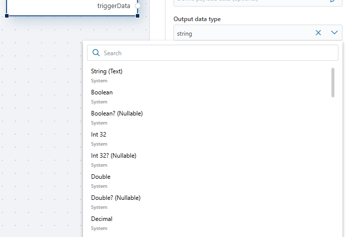

# Azure Service Bus Topic trigger

When a new message arrives in the [Azure Service Bus topic](https://learn.microsoft.com/en-us/azure/service-bus-messaging/service-bus-queues-topics-subscriptions#topics-and-subscriptions) subscription, the trigger detects it and starts the flow to process or handle the message as needed. This is useful for automating workflows that depend on incoming messages from Azure Service Bus topic.

**Example**   
This Flow listens for new customer-related messages published to an Azure Service Bus **topic**.  
When a message arrives, the Flow checks whether the payload contains the expected customer information.  
- If the required data exists, the customer record is inserted into the database.  
- If the data is missing, the Flow simply continues without writing to the database (in a production scenario you might also add logging or route invalid messages to a dead-letter queue).

## Properties

| Name           | Type     | Description                                      |
|----------------|----------|--------------------------------------------------|
| Title          |  Optional | A descriptive label for the trigger configuration. |
| Connection     | Required |Azure Service Bus connection string used to authenticate and connect to the service. |
| Subscription name| Optional | Name of the subscription under the Azure Service Bus topic to monitor for new messages. |
| Polling frequency| Required | Interval or schedule for how often the trigger checks for new messages in the topic. |
| Output data type | Optional | Specifies the format of the trigger's output data (e.g., JSON, XML). |
| Output variable name | Required | Name of the variable where the trigger’s output data will be stored. |
| Disabled       | Optional | Boolean value indicating whether the trigger is disabled (true/false). |
| Description    | Optional | Additional notes or comments about the trigger's purpose or configuration. |

## Returns

This trigger returns a single variable with the specified name and Output data type. 

 

**Example**   
This flow listens for messages from an Azure Service Bus topic, deserializes them into a ``MessageObject``, and stores the data in a SQL Server table. If the table or necessary columns don't exist, they are created or modified accordingly. If no message is received, the flow logs a debug message indicating that no message was found.

